# THE PHP HANDBOOK

> Esta é uma tradução feita por mim Fernando Wobeto do artigo original de Flavio Copes em https://www.freecodecamp.org/news/the-php-handbook.

> Traduzido por [Fernando Wobeto](https://www.fernandowobeto.com)

PHP é uma incrível e popular linguagem de programação.

As estatísticas dizem que ela é usada por 80% de todos os sites. 

Statistics say it’s used by 80% of all websites. É a linguagem que alimenta o WordPress, o sistema de gerenciamento de conteúdo amplamente utilizado para sites.

E também alimenta muitos frameworks diferentes que facilitam o desenvolvimento da Web, como o Laravel. Falando em Laravel, pode ser uma das razões mais convincentes para aprender PHP nos dias de hoje.

Porque aprender PHP?
--------------

PHP é uma linguagem bastante polarizadora. Algumas pessoas adoram, e algumas pessoas odeiam. Se dermos um passo acima das emoções e olharmos para a linguagem como uma ferramenta, o PHP tem muito a oferecer.

Claro que não é perfeita. Mas deixe-me dizer-lhe – nenhuma linguagem é.

Neste manual, vou ajudá-lo a aprender PHP.

Este manual é uma introdução perfeita se você é novo na linguagem. Também é perfeito se você já fez “algum PHP” no passado e deseja voltar a ele.

Eu vou explicar PHP moderno, versão 8+.

O PHP evoluiu muito nos últimos anos. Então, se a última vez que você tentou foi PHP 5 ou mesmo PHP 4, você ficará surpreso com todas as coisas boas que o PHP oferece agora.

Vamos lá!

Aqui está o que abordaremos neste manual:

1.  [Introdução ao PHP](#introduction-to-php)
2.  [Que tipo de linguagem é o PHP?](#what-kind-of-language-is-php)
3.  [Como configurar o PHP](#how-to-setup-php)
4.  [Como codificar seu primeiro programa em PHP](#how-to-code-your-first-php-program)
5.  [O básico do PHP](#php-language-basics)
6.  [Como trabalhar com Strings no PHP](#how-to-work-with-strings-in-php)
7.  [Como usar funções nativas para números em PHP](#how-to-use-built-in-functions-for-numbers-in-php)
8.  [Como funcionam os arrays em PHP](#how-arrays-work-in-php)
9.  [Como funcionam as condicionais no PHP](#how-conditionals-work-in-php)
10.  [Como funcionam os Loops em PHP](#how-loops-work-in-php)
11.  [Como funcionam as funções em PHP](#how-functions-work-in-php)
12.  [Como fazer um loop através de arrays com `map()`, `filter()`, e `reduce()` no PHP](#id="how-to-loop-through-arrays-with-map-filter-and-reduce-in-php)
13.  [Programação Orientada a Objetos no PHP](#object-oriented-programming-in-php)
14.  [Como incluir outros arquivos PHP](#how-to-include-other-php-files)
15.  [Constantes, funções e variáveis úteis para sistema de arquivos em PHP](#useful-constants-functions-and-variables-for-filesystem-in-php)
16.  [Como lidar com erros em PHP](#how-to-handle-errors-in-php)
17.  [Como lidar com exceções em PHP](#how-to-handle-exceptions-in-php)
18.  [Como trabalhar com datas no PHP](#how-to-work-with-dates-in-php)
19.  [Como usar constantes e enumeradores no PHP](#how-to-use-constants-and-enums-in-php)
20.  [Como usar o PHP como uma plataforma de desenvolvimento de aplicativos da Web](#how-to-use-php-as-a-web-app-development-platform)
21.  [Como usar Composer e Packagist](#how-to-use-composer-and-packagist)
22.  [Como efetuar deploy de uma aplicação PHP](#how-to-deploy-a-php-application)
23.  [Conclusão](#conclusion)


Note que você por pegar uma versão em [PDF, ePub, or Mobi](https://thevalleyofcode.com/download/php/) desse manual para referência mais fácil, ou para leitura no seu Kindle ou table.

Introdução ao PHP
-------------------

PHP é uma linguagem de programação que muitos desenvolvedores usam para criar aplicações web, entre outras coisas.

Como linguagem, teve um começo humilde. Foi criado em 1994 por Rasmus Lerdorf para construir seu site pessoal. Ele não sabia na época que se tornaria uma das linguagens de programação mais populares do mundo. Tornou-se popular mais tarde, em 1997/8, e explodiu nos anos 2000, quando o PHP 4 chegou.

Você pode usar o PHP para adicionar um pouco de interatividade a uma página HTML.

Ou você pode usá-lo como um mecanismo de aplicação Web que cria páginas HTML dinamicamente e as envia para o navegador.

Ele pode ser dimensionado para milhões de visualizações.

Você sabia que o Facebook é alimentado por PHP? Já ouviu falar da Wikipédia? SLack? Etsy?

Que tipo de linguagem é o PHP?
-----------------------------

Vamos entrar em algum jargão técnico.

As linguagens de programação são divididas em grupos, dependendo de suas características. Por exemplo interpretado/compilado, tipado forte/fraca, tipado dinamicamente/estaticamente.

O PHP é frequentemente chamado de “linguagem de script” e é uma **linguagem interpretada**. Se você usou linguagens compiladas como C ou Go ou Swift, a principal diferença é que você não precisa compilar um programa PHP antes de executá-lo.

Essas linguagens são compiladas e o compilador gera um programa executável que você executa. É um processo de 2 etapas.

O PHP _interpreter_ é responsável por interpretar as instruções escritas em um programa PHP quando ele é executado. É apenas um passo. Você diz ao interpretador para executar o programa. É um fluxo de trabalho completamente diferente.

PHP é uma **linguagem tipada dinamicamente**. Os tipos de variáveis ​​são verificados em tempo de execução, e não antes que o código seja executado, como acontece com linguagens de tipagem estática. (Estes também são compilados – as duas características geralmente andam de mãos dadas.)

O PHP também é vagamente (fracamente) tipado. Comparado com linguagens fortemente tipadas como Swift, Go, C ou Java, você não precisa declarar os tipos de suas variáveis.

Ser interpretado e tipado de forma flexível/dinamicamente tornará os bugs mais difíceis de encontrar antes que eles aconteçam em tempo de execução.

Em linguagens compiladas, muitas vezes você pode detectar erros em tempo de compilação, algo que não acontece em linguagens interpretadas.

Mas, por outro lado, uma linguagem interpretada tem mais flexibilidade.

Curiosidade: PHP é escrito internamente em C, uma linguagem compilada e estaticamente tipada.

Em sua natureza, o PHP é semelhante ao JavaScript, outra linguagem dinamicamente tipada, livremente tipada e interpretada.

PHP suporta programação orientada a objetos e também programação funcional. Você pode usar como preferir.

Como configurar o PHP
----------------

Existem muitas maneiras de instalar o PHP em sua máquina local.

A maneira mais conveniente que encontrei para instalar o PHP localmente é usar o MAMP.

MAMP é uma ferramenta que está disponível gratuitamente para todos os sistemas operacionais – Mac, Windows e Linux. É um pacote que lhe dá todas as ferramentas que você precisa para começar a trabalhar.

O PHP é executado por um Servidor HTTP, que é responsável por responder às requisições HTTP, aquelas feitas pelo navegador. Então você acessa uma URL com seu navegador, Chrome ou Firefox ou Safari, e o servidor HTTP responde com algum conteúdo HTML.

O servidor normalmente é Apache ou NGINX.

Então, para fazer qualquer coisa não trivial, você precisará de um banco de dados, como o MySQL.

O MAMP é um pacote que fornece tudo isso e muito mais, e oferece uma interface agradável para iniciar/parar tudo de uma vez.

Claro, você pode configurar cada peça por conta própria, se quiser, e muitos tutoriais explicam como fazer isso. Mas eu gosto de ferramentas simples e práticas, e o MAMP é uma delas.

Você pode seguir este manual com qualquer tipo de método de instalação PHP, não apenas MAMP.

Dito isso, se você ainda não tem o PHP instalado e quer usar o MAMP, vá para [https://www.mamp.info](https://www.mamp.info/) e instale ele.

O processo dependerá do seu sistema operacional, mas assim que terminar a instalação, você terá um aplicativo “MAMP” instalado.

Inicie isso e você verá uma janela semelhante a esta:

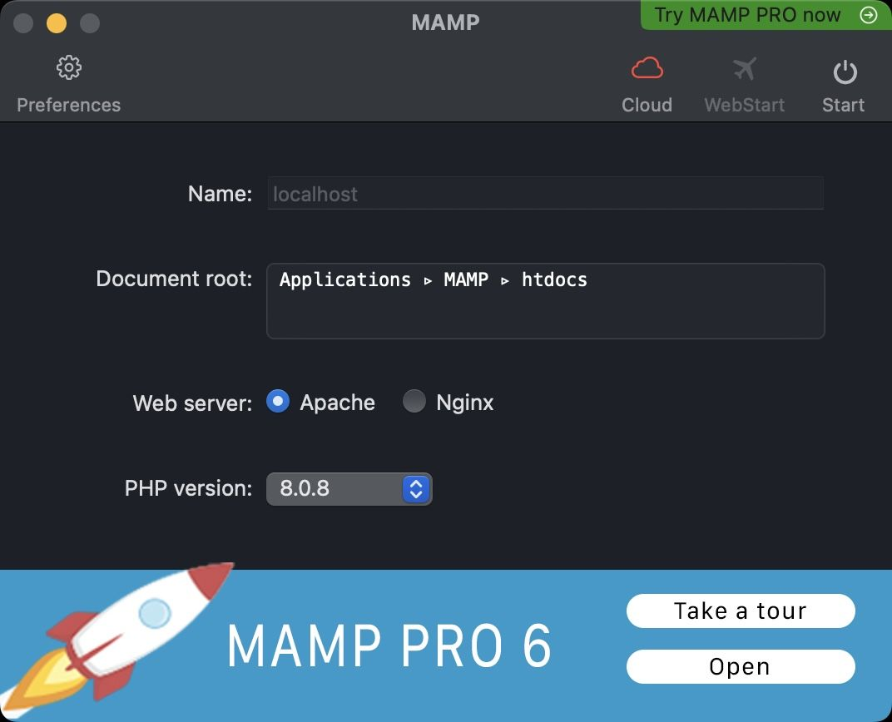

Certifique-se de que a versão do PHP selecionada seja a mais recente disponível.

No momento em que escrevo, o MAMP permite que você escolha 8.0.8.

NOTA: Percebi que o MAMP tem uma versão um pouco atrasada, não a mais recente. Você pode instalar uma versão mais recente do PHP ativando a demonstração do MAMP PRO e, em seguida, instalar a versão mais recente das configurações do MAMP PRO (no meu caso foi 8.1.0). Em seguida, feche-o e reabra o MAMP (versão não profissional). O MAMP PRO tem mais recursos, então você pode querer usá-lo, mas não é necessário seguir este manual.

Pressione o botão Iniciar no canto superior direito. Isso iniciará o servidor Apache HTTP, com PHP habilitado, e o banco de dados MySQL.

Vá para a url [http://localhost:8888](http://localhost:8888/) e você verá uma página similar a esta:

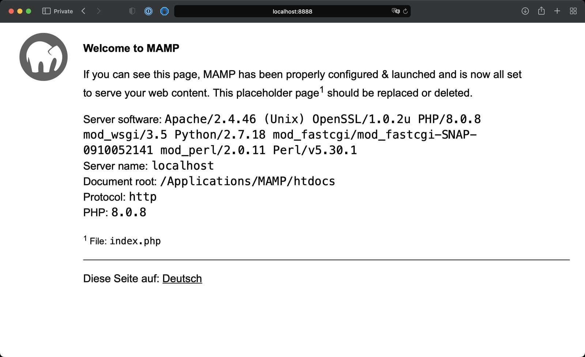

Nós estamos prontos para escrever algum PHP!

Abra a pasta listada como “Document root”. Se você está usando MAMP em um Mac, é por padrão `/Applications/MAMP/htdocs`.

No windows é `C:\MAMP\htdocs`.

O seu pode ser diferente dependendo da sua configuração. Usando o MAMP, você pode encontrá-lo na interface do usuário do aplicativo.

Lá, você encontrará um arquivo chamado `index.php`.

Que é responsável por imprimir a página mostrada acima.

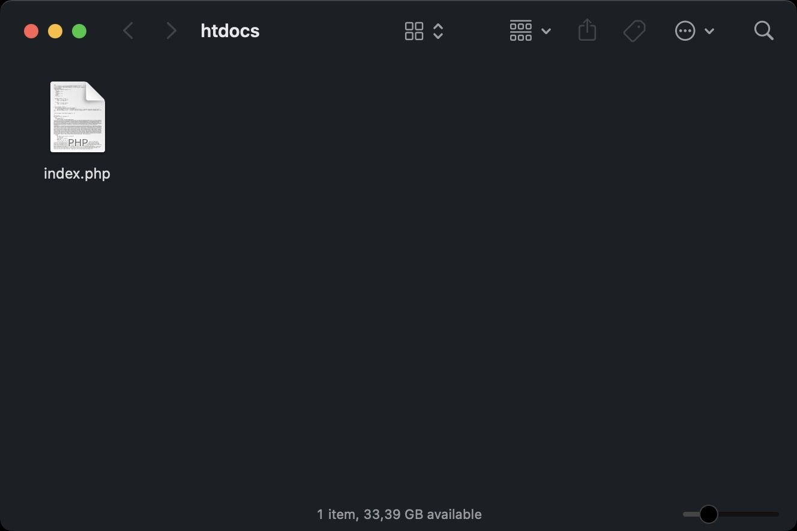

Como codificar seu primeiro programa em PHP
----------------------------------

Ao aprender uma nova linguagem de programação, temos essa tradição de criar uma aplicação “Hello, World!”. Algo que imprima essas strings.

Certifique-se de que o MAMP esteja rodando e abra a pasta `htdocs` como explicado acima.

Abra o arquivo `index.php` em um editor de código.

Eu recomendo usar o [VS Code](https://code.visualstudio.com), pois é um editor de código muito simples e poderoso. Você pode conferir em [https://flaviocopes.com/vscode/](https://flaviocopes.com/vscode/) para uma introdução.

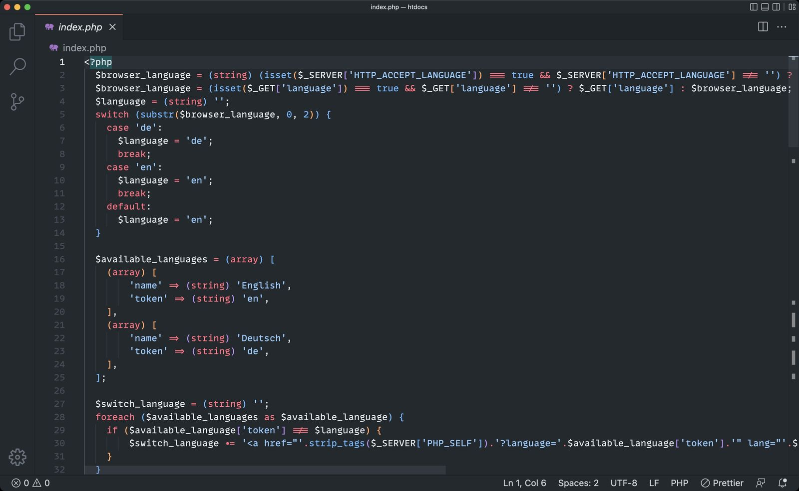

Este é o código que gera a página “Bem-vindo ao MAMP” que você viu no navegador.

Apague tudo e substitua por:
```php
<?php
echo 'Hello World';
?>
``` 

Salve, atualize a página em [http://localhost:8888](http://localhost:8888), você deve ver o seguinte:

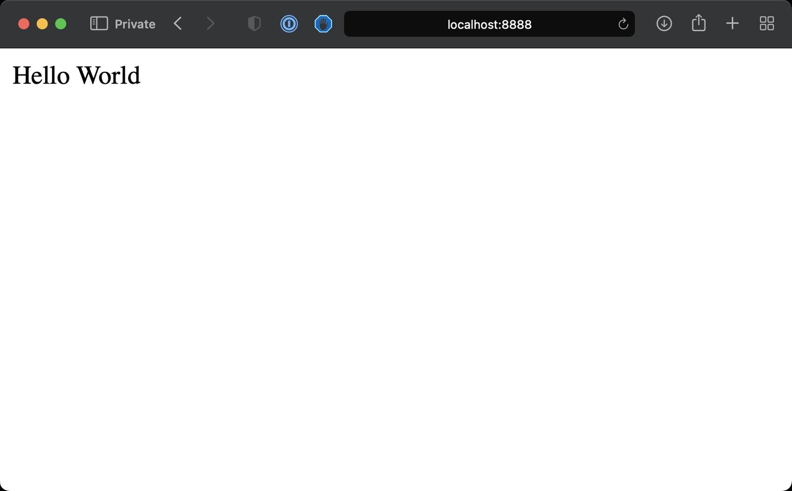

Excelente! Esse foi o seu primeiro programa PHP.

Vamos explicar o que está acontecendo aqui.

Temos o servidor Apache HTTP escutando na porta `8888` no localhost, seu computador.

Quando nós acessamos [http://localhost:8888](http://localhost:8888) com o navegador, nós estamos fazendo uma requisição HTTP, solicitando o conteúdo da rota `/`, a URL base.

O Apache, por padrão, está configurado para servir essa rota servindo o arquivo `index.html` incluído na pasta `htdocs`. Esse arquivo não existe – mas como configuramos o Apache para trabalhar com PHP, ele procurará por um arquivo `index.php`.

Esse arquivo existe e o código PHP é executado no lado do servidor antes que o Apache envie a página de volta ao navegador.

No arquivo PHP, temos uma abertura `<?php`, que diz “aqui começa algum código PHP”.

Temos um final `?>` que fecha o trecho de código PHP, e dentro dele, usamos a instrução `echo` para imprimir a string entre aspas no HTML.

Um ponto e vírgula é necessário no final de cada instrução.

Temos essa estrutura de abertura/fechamento porque podemos embutir PHP dentro de HTML. PHP é uma linguagem de script, e seu objetivo é poder “decorar” uma página HTML com dados dinâmicos.

Observe que, com o PHP moderno, geralmente evitamos misturar PHP no HTML. Em vez disso, usamos PHP como um “framework para gerar o HTML” – por exemplo, usando ferramentas como Laravel. Mas vamos discutir PHP simples neste livro, então faz sentido começar do básico.

Por exemplo, algo assim lhe dará o mesmo resultado no navegador:
```php
Hello
<?php
echo 'World';
?>
``` 

Para o usuário final, que olha para o navegador e não tem ideia do código nos bastidores, não há diferença alguma.

A página é tecnicamente uma página HTML, embora não contenha tags HTML, mas apenas uma string `Hello World`. Mas o navegador pode descobrir como exibir isso na janela.

Fundamentos da Linguagem PHP
-------------------

Após o primeiro “Hello World”, é hora de mergulhar nos recursos do idioma com mais detalhes.

### Como as variáveis funcionam no PHP

Variáveis em PHP começam com o cifrão `$`, seguido por um identificador, que é um conjunto de caracteres alfanuméricos e o caractere de sublinhado `_`.

Você pode atribuir a uma variável qualquer tipo de valor, como strings (definidas usando aspas simples ou duplas):
```php
$name = 'Flavio';
```    

Ou números:

```php
$age = 20;
```

ou qualquer outro tipo permitido pelo PHP, como veremos mais tarde.

Uma vez que uma variável recebe um valor, por exemplo, uma string, podemos reatribuir a ela um tipo diferente de valor, como um número:

```php
$name = 3;
```

O PHP não vai reclamar que agora o tipo é diferente.

Os nomes de variáveis diferenciam maiúsculas de minúsculas. `$name` é diferente de `$Name`.

Não é uma regra rígida, mas geralmente os nomes das variáveis são escritos no formato camelCase, como este: `$brandOfCar` ou `$ageOfDog`. Mantemos a primeira letra minúscula e as letras das palavras seguintes em maiúsculas.

### Como escrever comentários no PHP

Uma parte muito importante de qualquer linguagem de programação é como você escreve comentários.

Você escreve comentários de linha única em PHP desta forma:
```php
// comentário de linha única
``` 

Comentários de várias linhas são definidos desta maneira:
```php
/*

isto é um comentário

*/

//ou

/*
  *
  * isto é um comentário
  *
  */

//ou para comentar uma parte do código dentro de uma linha:

/* isto é um comentário */
```    

### O que são tipos em PHP?

Eu mencionei strings e numéros.

PHP tem os seguintes tipos:

*   `bool` valores boleanos (true/false)
*   `int` números inteiros (no decimals)
*   `float` números de ponto flutuante (decimals)
*   `string` strings
*   `array` arrays
*   `object` objetos
*   `null` um valor que significa “nenhum valor atribuído”

e alguns outros mais avançados.

### Como imprimir o valor de uma variável em PHP

Podemos usar a função interna `var_dump()` para obter o valor de uma variável:
```php
$name = 'Flavio';

var_dump($name);
``` 

A instrução `var_dump($name)` imprimirá `string(6) "Flavio"` na página, o que nos diz que a variável é uma string de 6 caracteres.

Se usássemos este código:
```php
$age = 20;
    
var_dump($age);
```    

teríamos `int(20)` de volta, dizendo que o valor é 20 e é um inteiro.

`var_dump()` é uma das ferramentas essenciais em seu cinto de ferramentas de depuração PHP.

### Como funcionam os operadores em PHP

Uma vez que você tenha algumas variáveis, você pode fazer operações com elas:
```php
$base = 20;
$height = 10;

$area = $base * $height;
``` 

O `*` que usei para multiplicar $base por $height é o operador de multiplicação.

Temos alguns operadores - então vamos fazer um rápido resumo dos principais.

Para começar, aqui estão os operadores aritméticos: `+`, `-`, `*`, `/` (divisão), `%` (restante) e `**` (exponencial).

Temos o operador de atribuição `=`, que já usamos para atribuir um valor a uma variável.

Em seguida, temos operadores de comparação, como `<`, `>`, `<=`, `>=`. Aqueles funcionam como eles fazem em matemática.

```php
2 < 1; //false
1 <= 1; // true
1 <= 2; // true
```
    

`==` retorna true se os dois operandos são iguais.

`===` retorna true se os dois operandos são idênticos.

Qual a diferença?

Você vai encontrá-lo com experiência, mas por exemplo:

```php
1 == '1'; //true
1 === '1'; //false
```

Também temos `!=` para detectar se os operandos NÃO são iguais:

```php
1 != 1; //false
1 != '1'; //false
1 != 2; //true

//dica: <> funciona da mesma forma como !=, 1 <> 1
``` 

e `!==` para detectar se os operandos não são idênticos:
```php
1 !== 1; //false
1 !== '1'; //true
```

Operadores lógicos trabalham com valores booleanos:
```php
// Lógico AND com && ou "and"

true && true; //true
true && false; //false
false && true; //false
false && false; //false

true and true; //true
true and false; //false
false and true; //false
false and false; //false

// Lógico OR com || ou "or"

true || true; // true
true || false //true
false || true //true
false || false //false

true or true; // true
true or false //true
false or true //true
false or false //false

// Lógico XOR (um dos dois é true, mas não ambos)

true xor true; // false
true xor false //true
false xor true //true
false xor false //false
``` 

Nós temos também o operador NOT:
```php
$test = true

!$test //false
``` 

Eu usei os valores booleanos `true` e `false` aqui, mas na prática você usará expressões que avaliam como true ou false, por exemplo:
```php
1 > 2 || 2 > 1; //true

1 !== 2 && 2 > 2; //false
``` 

Todos os operadores listados acima são _binários_, o que significa que envolvem 2 operandos.

PHP também tem 2 operadores unários: `++` e `--`:
```php
$age = 20;
$age++;
//age agora é 21

$age--;
//age agora é 20
```    

Como trabalhar com strings em PHP
-------------------------------

Eu introduzi o uso de strings antes quando falamos sobre variáveis e definimos uma string usando esta notação:
```php
$name = 'Flavio'; //string definida com aspas simples
    
$name = "Flavio"; //string definida com aspas duplas
``` 

A grande diferença entre usar aspas simples e duplas é que com aspas duplas podemos expandir as variáveis desta forma:
```php
$test = 'an example';

$example = "This is $test"; //This is an example
```    

e com aspas duplas podemos usar caracteres de escape (pense em novas linhas `\n` ou tabulações `\t`):
```php
$example = "This is a line\nThis is a line";

/*
a saída será:

This is a line
This is a line
*/
```    

O PHP oferece funções muito abrangentes em sua biblioteca padrão (a biblioteca de funcionalidades que a linguagem oferece por padrão).

Primeiro, podemos concatenar duas strings usando o operador `.`:
```php
$firstName = 'Flavio';
$lastName = 'Copes';
    
$fullName = $firstName . ' ' . $lastName;
```

Podemos verificar o comprimento de uma string usando a função `strlen()`:
```php
$name = 'Flavio';
strlen($name); //6
```    

Esta é a primeira vez que usamos uma função.

Uma função é composta por um identificador (`strlen` neste caso) seguido por parênteses. Dentro desses parênteses, passamos um ou mais argumentos para a função. Neste caso, temos um argumento.

A função faz faz alguma coisa e quando termina pode retornar um valor. Neste caso, ele retorna o número `6`. Se não houver valor retornado, a função retornará `null`.

Veremos como definir nossas próprias funções mais tarde.

Podemos obter uma parte de uma string usando `substr()`:
```php
$name = 'Flavio';
substr($name, 3); //"vio" - começa na posição 3, pega todo o resto
substr($name, 2, 2); //"av" - começa na posição 2, pega 2 itens
```    

Podemos substituir uma parte de uma string usando `str_replace()`:
```php
$name = 'Flavio';
str_replace('avio', 'ower', $name); //"Flower"
```    

Claro que podemos atribuir o resultado a uma nova variável:
```php
$name = 'Flavio';
$itemObserved = str_replace('avio', 'ower', $name); //"Flower"
```    

Há muito mais funções internas que você pode usar para trabalhar com strings.

Aqui está uma breve lista não abrangente apenas para mostrar as possibilidades:

*   [`trim()`](https://www.php.net/manual/en/function.trim.php) remove o espaço em branco no início e no final de uma string
*   [`strtoupper()`](https://www.php.net/manual/en/function.strtoupper.php) faz uma string maiúscula
*   [`strtolower()`](https://www.php.net/manual/en/function.strtolower.php) faz uma string minúscula
*   [`ucfirst()`](https://www.php.net/manual/en/function.ucfirst.php) torna o primeiro caractere maiúsculo
*   [`strpos()`](https://www.php.net/manual/en/function.strpos.php) encontra a primeira ocorrência de uma substring na string
*   [`explode()`](https://www.php.net/manual/en/function.explode.php) para dividir uma string em um array
*   [`implode()`](https://www.php.net/manual/en/function.implode.php) para juntar elementos de array em uma string

Você pode encontrar uma lista completa [aqui](https://www.php.net/manual/en/book.strings.php).

Como usar funções internas para números em PHP
------------------------------------------------

Eu listei anteriormente as poucas funções que normalmente usamos para strings.

Vamos fazer uma lista das funções que usamos com números:

*   [`round()`](https://www.php.net/manual/en/function.round.php) para arredondar um número decimal, para cima/para baixo, dependendo se o valor for > 0,5 ou menor
*   [`ceil()`](https://www.php.net/manual/en/function.ceil.php) arredondar um número decimal para cima
*   [`floor()`](https://www.php.net/manual/en/function.floor.php) para arredondar um número decimal para baixo
*   [`rand()`](https://www.php.net/manual/en/function.rand.php) gera um inteiro aleatório
*   [`min()`](https://www.php.net/manual/en/function.min.php) encontra o número mais baixo nos números passados como argumentos
*   [`max()`](https://www.php.net/manual/en/function.max.php) encontra o número mais alto nos números passados como argumentos
*   [`is_nan()`](https://www.php.net/manual/en/function.is-nan.php) retorna true se o número não for um número

Há uma tonelada de funções diferentes para todos os tipos de operações matemáticas, como seno, cosseno, tangentes, logaritmos e assim por diante. Você pode encontrar uma lista completa [aqui](https://www.php.net/manual/en/book.math.php).

Como os arrays funcionam em PHP
----------------------

Arrays são listas de valores agrupados sob um nome comum.

Você pode definir um array vazio de duas maneiras diferentes:
```php
$list = [];

$list = array();
```    

Um array pode ser inicializado com valores:
```php
$list = [1, 2];

$list = array(1, 2);
```    

Arrays podem conter valores de qualquer tipo:
```php
$list = [1, 'test'];
```    

Mesmo de outros arrays:
```php
$list = [1, [2, 'test']];
```    

Você pode acessar o elemento em um array usando esta notação:
```php
$list = ['a', 'b'];
$list[0]; //'a' --o índice começa em 0
$list[1]; //'b'
```

Depois que um array é criado, você pode anexar valores a ele desta maneira:
```php
$list = ['a', 'b'];
$list[] = 'c';

/*
$list == [
  "a",
  "b",
  "c",
]
*/
```    

Você pode usar `array_unshift()` para adicionar o item no início do array:
```php
$list = ['b', 'c'];
array_unshift($list, 'a');

/*
$list == [
  "a",
  "b",
  "c",
]
*/
```    

Conte quantos itens estão em um array usando a função interna `count()`:
```php
$list = ['a', 'b'];

count($list); //2
```    

Verifique se um array contém um item usando a função interna `in_array()`:
```php
$list = ['a', 'b'];

in_array('b', $list); //true
```    

Se além de confirmar a existência, você precisa do índice, use `array_search()`:
```php
$list = ['a', 'b'];

array_search('b', $list) //1
```    

### Funções úteis para arrays em PHP

Assim como com strings e números, o PHP fornece muitas funções muito úteis para arrays. Nós vimos `count()`, `in_array()`, `array_search()` – vamos ver um pouco mais:

*   `is_array()` para verificar se uma variável é um array
*   `array_unique()` para remover valores duplicados de um array
*   `array_search()` para pesquisar um valor no array e retornar a chave
*   `array_reverse()` para inverter um array
*   `array_reduce()` para reduzir um array a um único valor usando uma função de retorno de chamada
*   `array_map()` para aplicar uma função de retorno de chamada a cada item no array. Normalmente usado para criar um novo array modificando os valores de um array existente, sem alterá-lo.
*   `array_filter()` para filtrar um array para um único valor usando uma função de retorno de chamada
*   `max()` para obter o valor máximo contido no array
*   `min()` para obter o valor mínimo contido no array
*   `array_rand()` para obter um item aleatório do array
*   `array_count_values()` para contar todos os valores no array
*   `implode()` transformar um array em uma string
*   `array_pop()` para remover o último item do array e retornar seu valor
*   `array_shift()` igual a `array_pop()` mas remove o primeiro item em vez do último
*   `sort()` para ordenar um array
*   `rsort()` para classificar um array na ordem inversa
*   `array_walk()` da mesma forma que `array_map()` faz algo para cada item no array, mas além disso pode alterar valores no array existente

### Como usar arrays associativos em PHP

Até agora usamos arrays com um índice numérico incremental: 0, 1, 2…

Você também pode usar arrays com índices nomeados (chaves), e nós os chamamos de arrays associativos:
```php
$list = ['first' => 'a', 'second' => 'b'];

$list['first'] //'a'
$list['second'] //'b'
```    

Temos algumas funções que são especialmente úteis para arrays associativos:

*   `array_key_exists()` para verificar se existe uma chave no array
*   `array_keys()` para obter todas as chaves do array
*   `array_values()` para obter todos os valores do array
*   `asort()` para classificar um array associativo por valor
*   `arsort()` para classificar um array associativo em ordem decrescente por valor
*   `ksort()` para classificar um array associativo por chave
*   `krsort()` para classificar um array associativo em ordem decrescente por chave

Você pode ver todas as funções relacionadas a array [aqui](https://www.php.net/manual/en/ref.array.php).

Como funcionam as condicionais em PHP
----------------------------

Anteriormente, apresentei operadores de comparação: `<`, `>`, `<=`, `>=`, `==`, `===` , `!=`, `!==`... e assim sobre.

Esses operadores serão super úteis para uma coisa:
 **condicionais**.

As condicionais são a primeira estrutura de controle que vemos.

Podemos decidir fazer algo, ou outra coisa, com base em uma comparação.

Por exemplo:
```php
$age = 17;

if ($age > 18) {
  echo 'You can enter the pub';
}
```    

O código dentro dos parênteses só é executado se a condição for avaliada como `true`.

Use `else` para fazer algo caso a condição seja `false`:
```php
$age = 17;

if ($age > 18) {
  echo 'You can enter the pub';
} else {
  echo 'You cannot enter the pub';
}
```    

NOTA: Eu usei `cannot` em vez de `can't` porque as aspas simples terminariam minha string antes que deveria. Neste caso você pode escapar do `'` desta forma: `echo 'You can\'t enter the pub';`

Você pode ter várias instruções `if` encadeadas usando `elseif`:
```php
$age = 17;

if ($age > 20) {
  echo 'You are 20+';
} elseif ($age > 18) {
  echo 'You are 18+';
} else {
  echo 'You are <18';
}
```    

Além de `if`, temos a instrução `switch`.

Usamos isso quando temos uma variável que pode ter alguns valores diferentes, e não precisamos ter um bloco if/elseif longo:
```php
$age = 17

switch($age) {
  case 15:
    echo 'You are 15';
    break;
  case 16:
    echo 'You are 16';
    break;
  case 17:
    echo 'You are 17';
    break;
  case 18:
    echo 'You are 18';
    break;
  default:
    echo "You are $age";
}
```    

Eu sei que o exemplo não tem lógica, mas acho que pode te ajudar a entender como o `switch` funciona.

A instrução `break;` após cada case é essencial. Se você não adicionar isso e a idade for 17, você verá isso:
```
You are 17
You are 18
You are 17
```    

Em vez de apenas isso:
```
You are 17
```    

como você esperaria.

Como os loops funcionam em PHP
---------------------

Loops são outra estrutura de controle super útil.

Temos alguns tipos diferentes de loops em PHP: `while`, `do while`, `for` e `foreach`.

Vamos ver todos eles!

### Como usar um loop `while` em PHP

Um loop `while` é o mais simples. Ele continua iterando enquanto a condição é avaliada como `true`:
```php
while (true) {
  echo 'looping';
}
```    

Isso seria um loop infinito, e é por isso que usamos variáveis e comparações:
```php
$counter = 0;

while ($counter < 10) {
  echo $counter;
  $counter++;
}
```    

### Como usar um loop `do while` em PHP

`do while` é semelhante, mas um pouco diferente em como a primeira iteração é executada:
```php
$counter = 0;

do {
  echo $counter;
  $counter++;
} while ($counter < 10);
```    

No loop `do while`, primeiro fazemos a primeira iteração, depois verificamos a condição.

No loop `while`, primeiro verificamos a condição, depois fazemos a iteração.

Faça um teste simples configurando `$counter` para 15 nos exemplos acima e veja o que acontece.

Você vai querer escolher um tipo de loop ou outro, dependendo do seu caso de uso.

### Como usar um loop `foreach` em PHP

Você pode usar o loop `foreach` para iterar facilmente em um array:
```php
$list = ['a', 'b', 'c'];

foreach ($list as $value) {
  echo $value;
}
```    

Você também pode obter o valor do índice (ou chave em um array associativo) desta forma:
```php
$list = ['a', 'b', 'c'];

foreach ($list as $key => $value) {
  echo $key;
}
```    

### Como usar um loop `for` em PHP

O loop `for` é semelhante ao while, mas ao invés de definir a variável usada na condicional antes do loop, e ao invés de incrementar a variável index manualmente, tudo é feito na primeira linha:
```php
for ($i = 0; $i < 10; $i++) {
  echo $i;
}

//resultado: 0123456789
```    

62 / 5.000
Resultados de tradução
Você pode usar o loop for para iterar sobre um array desta maneira:
```php
$list = ['a', 'b', 'c'];

for ($i = 0; $i < count($list); $i++) {
  echo $list[$i];
}

//resultado: abc
```    

### Como usar as instruções `break` e `continue` em PHP

Em muitos casos, você deseja interromper um loop sob demanda.

Por exemplo, você deseja parar um loop `for` quando o valor da variável no array for `'b'`:
```php
$list = ['a', 'b', 'c'];

for ($i = 0; $i < count($list); $i++) {
  if ($list[$i] == 'b') {
    break;
  }
  echo $list[$i];
}

//resultado: a
```    

Isso faz com que o loop pare completamente nesse ponto e a execução do programa continue na próxima instrução após o loop.

Se você quiser apenas pular a iteração do loop atual e continuar procurando, use `continue`:
```php
$list = ['a', 'b', 'c'];

for ($i = 0; $i < count($list); $i++) {
  if ($list[$i] == 'b') {
    continue;
  }
  echo $list[$i];
}

//resultado: ac
```    

Como as funções funcionam em PHP
-------------------------

As funções são um dos conceitos mais importantes na programação.

Você pode usar funções para agrupar várias instruções ou várias linhas de código e dar a elas um nome.

Por exemplo, você pode fazer uma função que envia um email. Vamos chamá-lo de `sendEmail`, e vamos defini-lo assim:
```php
function sendEmail() {
  //envia um e-mail
}
```    

E você pode chamá-la em qualquer outro lugar usando esta sintaxe:
```php
sendEmail();
```    

Você também pode passar argumentos para uma função. Por exemplo, quando você envia um e-mail, você deseja enviá-lo para alguém – então você adiciona o e-mail como o primeiro argumento:
```php
sendEmail('test@test.com');
```    

Dentro da definição da função obtemos este parâmetro desta forma (nós os chamamos de "parâmetros" dentro da definição da função, e "argumentos" quando chamamos a função):
```php
function sendEmail($to) {
  echo "send an email to $to";
}
```    

Você pode enviar vários argumentos separando-os com vírgulas:
```php
sendEmail('test@test.com', 'subject', 'body of the email');
```    

E podemos obter esses parâmetros na ordem em que foram definidos:
```php
function sendEmail($to, $subject, $body) {
  //...
}
```    

Podemos **opcionalmente** definir o tipo de parâmetros:
```php
function sendEmail(string $to, string $subject, string $body) {
  //...
}
```    

Os parâmetros podem ter um valor padrão, portanto, se forem omitidos, ainda podemos ter um valor para eles:
```php
function sendEmail($to, $subject = 'test', $body = 'test') {
  //...
}

sendEmail('test@test.com')
```    

Uma função pode retornar um valor. Apenas um valor pode ser retornado de uma função, não mais de um. Você faz isso usando a palavra-chave `return`. Se omitido, a função retorna `null`.

O valor retornado é super útil, pois informa o resultado do trabalho realizado na função e permite que você use seu resultado após chamá-lo:
```php
function sendEmail($to) {
  return true;
}

$success = sendEmail('test@test.com');

if ($success) {
  echo 'email sent successfully';
} else {
  echo 'error sending the email';
}
```    

Podemos **opcionalmente** definir o tipo de retorno de uma função usando esta sintaxe:
```php
function sendEmail($to): bool {
  return true;
}
```    

Quando você define uma variável dentro de uma função, essa variável é **local** para a função, o que significa que não é visível de fora. Quando a função termina, ela simplesmente para de existir:
```php
function sendEmail($to) {
  $test = 'a';
}

var_dump($test); //PHP Warning:  Undefined variable $test
```    

Variáveis definidas fora da função **não** são acessíveis dentro da função.

Isso impõe uma boa prática de programação, pois podemos ter certeza de que a função não modifica variáveis externas e causa “efeitos colaterais”.

Em vez disso, você retorna um valor da função e o código externo que chama a função assumirá a responsabilidade de atualizar a variável externa.

Assim:
```php
$character = 'a';

function test() {
  return 'b';
}

$character = test();
```    

Você pode passar o valor de uma variável passando-a como argumento para a função:
```php
$character = 'a';

function test($c) {
  echo $c;
}

test($character);
```    

Mas você não pode modificar esse valor de dentro da função.

Ela é **passada por valor**, o que significa que a função recebe uma cópia dela, não a referência à variável original.

Isso ainda é possível usando esta sintaxe (observe que usei `&` na definição do parâmetro):
```php
$character = 'a';

function test(&$c) {
  $c = 'b';
}

test($character);

echo $character; //'b'
```    

As funções que definimos até agora são **funções nomeadas**.

Eles têm um nome.

Também temos **funções anônimas**, que podem ser úteis em muitos casos.

Eles não têm um nome, por si só, mas são atribuídos a uma variável. Para chamá-los, você invoca a variável com parênteses no final:
```php
$myfunction = function() {
  //faz alguma coisa aqui
};

$myfunction()
```    

Observe que você precisa de um ponto e vírgula após a definição da função, mas eles funcionam como funções nomeadas para valores de retorno e parâmetros.

Curiosamente, eles oferecem uma maneira de acessar uma variável definida fora da função através de `use()`:
```php
$test = 'test';

$myfunction = function() use ($test) {
  echo $test;
  return 'ok';
};

$myfunction()
```    

Outro tipo de função é uma **função de seta**.

Uma função de seta é uma função anônima que é apenas uma expressão (uma linha) e retorna implicitamente o valor dessa expressão.

Você define assim:
```php
fn (arguments) => expression;
``` 

Aqui está um exemplo:
```php
$printTest = fn() => 'test';

$printTest(); //'test'
```    

Você pode passar parâmetros para uma função de seta:
```php
$multiply = fn($a, $b) => $a * $b;

$multiply(2, 4) //8
```    

Observe que, como mostra o próximo exemplo, as funções de seta têm acesso automático às variáveis do escopo delimitador, sem a necessidade de `use()`.
```php
$a = 2;
$b = 4;

$multiply = fn() => $a * $b;

$multiply()
```    
As **Arrow functions** são super úteis quando você precisa passar uma função de retorno de chamada. Veremos como usá-los para realizar algumas operações de array mais tarde.

Portanto, temos no total 3 tipos de funções: **funções nomeadas**, **funções anônimas** e **arrow functions**.

Cada um deles tem seu lugar e você aprenderá a usá-los corretamente ao longo do tempo, com a prática.

Como percorrer arrays com `map()`, `filter()` e `reduce()` em PHP
--------------------------------------------------------------------------

Outro conjunto importante de estruturas de loop, frequentemente usado em programação funcional, é o conjunto de `array_map()` / `array_filter()` / `array_reduce()`.

Essas 3 funções embutidas do PHP pegam um array e uma função de retorno de chamada que em cada iteração pega cada item do array.

`array_map()` retorna um novo array que contém o resultado da execução da função callback em cada item do array:
```php
$numbers = [1, 2, 3, 4];
$doubles = array_map(fn($value) => $value * 2, $numbers);

//$doubles agora é [2, 4, 6, 8]
```    

`array_filter()` gera um novo array pegando apenas os itens cuja função de retorno de chamada retorna `true`:
```php
$numbers = [1, 2, 3, 4];
$even = array_filter($numbers, fn($value) => $value % 2 === 0)

//$even agora é [2, 4]
```    

`array_reduce()` é usado para reduzir um array para um único valor.

Por exemplo, podemos usá-lo para multiplicar todos os itens em um array:
```php
$numbers = [1, 2, 3, 4];

$result = array_reduce($numbers, fn($carry, $value) => $carry * $value, 1)
```    

Observe o último parâmetro – é o valor inicial. Se você omitir isso, o valor padrão é '0', mas isso não funcionaria para o nosso exemplo de multiplicação.

Observe que em `array_map()` a ordem dos argumentos é invertida. Primeiro você tem a função de retorno de chamada e depois o array. Isso ocorre porque podemos passar vários arrays usando vírgulas (`array_map(fn($value) => $value * 2, $numbers, $otherNumbers, $anotherArray);`). Idealmente, gostaríamos de mais consistência, mas é isso que é.

Programação Orientada a Objetos em PHP
----------------------------------

Vamos agora pular de cabeça em um grande tópico: programação orientada a objetos com PHP.

A programação orientada a objetos permite criar abstrações úteis e tornar seu código mais simples de entender e gerenciar.

### Como usar classes e objetos em PHP

Para começar, você tem classes e objetos.

Uma classe é um blueprint, ou tipo, de objeto.

Por exemplo, você tem a classe `Dog`, definida desta forma:
```php
class Dog {

}
```    

Observe que a classe deve ser definida em letras maiúsculas.

Então você pode criar objetos desta classe – cães (Dogs) específicos e individuais.

Um objeto é atribuído a uma variável e é instanciado usando a sintaxe `new Nomeclasse()`:
```php
$roger = new Dog();
```    

Você pode criar vários objetos da mesma classe, atribuindo cada objeto a uma variável diferente:
```php
$roger = new Dog();
$syd = new Dog();
```    

### Como usar propriedades em PHP

Esses objetos compartilharão as mesmas características definidas pela classe. Mas, uma vez instanciados, eles terão vida própria.

Por exemplo, um cão tem um nome, uma idade e uma cor de pele.

Assim, podemos defini-los como propriedades na classe:
```php
class Dog {
  public $name;
  public $age;
  public $color;
}
```    

Eles funcionam como variáveis, mas são anexados ao objeto, uma vez que é instanciado a partir da classe. A palavra-chave `public` é o _modificador de acesso_ e define a propriedade como acessível publicamente.

Você pode atribuir valores a essas propriedades desta maneira:
```php
class Dog {
  public $name;
  public $age;
  public $color;
}

$roger = new Dog();

$roger->name = 'Roger';
$roger->age = 10;
$roger->color = 'gray';

var_dump($roger);

/*
object(Dog)#1 (3) {
  ["name"]=> string(5) "Roger"
  ["age"]=> int(10)
  ["color"]=> string(4) "gray"
}
*/
```    

Observe que a propriedade é definida como `public`.

Isso é chamado de modificador de acesso. Você pode usar dois outros tipos de modificadores de acesso: `private` e `protected`. Private torna a propriedade inacessível de fora do objeto. Apenas métodos definidos dentro do objeto podem acessá-lo.

Veremos mais sobre protegido quando falarmos sobre herança.

### Como usar métodos em PHP

Eu disse método? O que é um método?

Um método é uma função definida dentro da classe e é definida desta forma:
```php
class Dog {
  public function bark() {
    echo 'woof!';
  }
}
```    

Os métodos são muito úteis para anexar um comportamento a um objeto. Neste caso, podemos fazer um cachorro latir.

Observe que eu uso a palavra-chave `public`. Isso quer dizer que você pode invocar um método de fora da classe. Assim como para propriedades, você também pode marcar métodos como `privados`, ou `protegidos`, para restringir seu acesso.

Você invoca um método na instância do objeto assim:
```php
class Dog {
  public function bark() {
    echo 'woof!';
  }
}

$roger = new Dog();

$roger->bark();
```    

Um método, assim como uma função, também pode definir parâmetros e um valor de retorno.

Dentro de um método podemos acessar as propriedades do objeto usando a variável interna especial `$this`, que, quando referenciada dentro de um método, aponta para a instância atual do objeto:
```php
class Dog {
  public $name;

  public function bark() {
    echo $this->name . ' barked!';
  }
}

$roger = new Dog();
$roger->name = 'Roger';
$roger->bark();
```    

Observe que usei `$this->name` para definir e acessar a propriedade `$name`, e não `$this->$name`.

### Como usar o método construtor em PHP

Um tipo especial de método chamado `__construct()` é chamado de **construtor**.
```php
class Dog {
  public function __construct() {

  }
}
```    

Você usa esse método para inicializar as propriedades de um objeto ao criá-lo, pois ele é invocado automaticamente ao chamar `new Classname()`.
```php
class Dog {
  public $name;

  public function __construct($name) {
    $this->name = $name;
  }

  public function bark() {
    echo $this->name . ' barked!';
  }
}

$roger = new Dog('Roger');
$roger->bark();
```    

Isso é uma coisa tão comum que o PHP (começando no PHP 8) inclui algo chamado **promoção do construtor**, onde automaticamente faz isso:
```php
class Dog {
  public $name;

  public function __construct($name) {
    $this->name = $name;
  }

  //...
```    

Ao usar o modificador de acesso, a atribuição do parâmetro do construtor para a variável local acontece automaticamente:
```php
class Dog {
  public function __construct(public $name) {
  }

  public function bark() {
    echo $this->name . ' barked!';
  }
}

$roger = new Dog('Roger');
$roger->name; //'Roger'
$roger->bark(); //'Roger barked!'
```    

As propriedades podem ser **tipadas**.

Você pode exigir que o nome seja uma string usando `public string $name`:
```php
class Dog {
  public string $name;

  public function __construct($name) {
    $this->name = $name;
  }

  public function bark() {
    echo $this->name . ' barked!';
  }
}

$roger = new Dog('Roger');
$roger->name; //'Roger'
$roger->bark(); //'Roger barked!'
```    

Agora tudo funciona bem neste exemplo, mas tente mudar isso para `public int $name` para exigir que seja um inteiro.

O PHP irá gerar um erro se você inicializar `$name` com uma string:
```php
TypeError: Dog::__construct():
    Argument #1 ($name) must be of type int,
    string given on line 14
```

Interessante, certo?

Podemos impor propriedades para ter um tipo específico entre `string`, `int`, `float`, `string`, `object`, `array`, `bool` e [outras](https://www.php.net/manual/en/language.types.declarations.php).

### O que é herança em PHP?

A diversão na programação orientada a objetos começa quando permitimos que classes herdem propriedades e métodos de outras classes.

Suponha que você tenha uma classe `Animal`:
```php
class Animal {
    
}
```

Todo animal tem uma idade, e todo animal pode comer. Então adicionamos uma propriedade `age` e um método `eat()`:
```php
class Animal {
  public $age;

  public function eat() {
    echo 'the animal is eating';
  }
}
```    

Um cachorro é um animal e tem uma idade e pode comer também, então a classe `Dog` – em vez de reimplementar as mesmas coisas que temos em `Animal` – pode estender essa classe:
```php
class Dog extends Animal {

}
```    

Agora podemos instanciar um novo objeto da classe `Dog` e temos acesso às propriedades e métodos definidos em `Animal`:
```php
$roger = new Dog();
$roger->eat();
```    

Nesse caso, chamamos Dog a **classe filha** e Animal a **classe pai**.

Dentro da classe filha podemos usar `$this` para referenciar qualquer propriedade ou método definido no pai, como se estivessem definidos dentro da classe filha.

Vale a pena notar que, embora possamos acessar as propriedades e métodos do pai a partir do filho, não podemos fazer o contrário.

A classe pai não sabe nada sobre a classe filha.

### Propriedades e métodos `protected` em PHP

Agora que introduzimos a herança, podemos discutir `protected`. Já vimos como podemos usar o modificador de acesso `public` para definir propriedades e métodos que podem ser chamados de fora de uma classe, pelo _public._

Propriedades e métodos `private` só podem ser acessados de dentro da classe.

Propriedades e métodos `protected` podem ser acessados de dentro da classe e de classes filhas.

### Como substituir métodos em PHP

O que acontece se tivermos um método `eat()` em `Animal` e quisermos personalizá-lo em `Dog`? Podemos **substituir** esse método.
```php
class Animal {
  public $age;

  public function eat() {
    echo 'the animal is eating';
  }
}

class Dog extends Animal {
  public function eat() {
    echo 'the dog is eating';
  }
}
```    

Agora qualquer instância de `Dog` usará a implementação do `Dog` do método `eat()`.

### Propriedades e Métodos Estáticos em PHP

Vimos como definir propriedades e métodos que pertencem **à instância de uma classe**, um objeto.

Às vezes é útil atribuí-los à própria classe.

Quando isso acontece nós os chamamos de **static**, e para referenciar ou chamá-los não precisamos criar um objeto da classe.

Vamos começar com propriedades estáticas. Nós as definimos com a palavra-chave `static`:
```php
class Utils {
  public static $version = '1.0';
}
```    

Nós os referenciamos de dentro da classe usando a palavra-chave `self`, que aponta para a classe:
```php
self::$version;
``` 

e de fora da classe usando:
```php
Utils::version
```

Isto é o que acontece para métodos estáticos:
```php
class Utils {
  public static function version() {
    return '1.0';
  }
}
```    

Do lado de fora da classe, podemos chamá-los desta forma:
```php
Utils::version();
```    

De dentro da classe, podemos referenciá-los usando a palavra-chave `self`, que se refere à classe atual:
```php
self::version();
```    

### Como comparar objetos em PHP

Quando falamos de operadores que mencionei temos o operador `==` para verificar se dois valores são iguais e `===` para verificar se são idênticos.

Principalmente a diferença é que `==` verifica o conteúdo do objeto, por exemplo, a string `'5'` é igual ao número `5`, mas não é idêntica a ele.

Quando usamos esses operadores para comparar objetos, `==` verificará se os dois objetos têm a mesma classe e têm os mesmos valores atribuídos a eles.

`===` por outro lado irá verificar se eles também se referem à mesma instância (objeto).

For example:
```php
class Dog {
  public $name = 'Good dog';
}

$roger = new Dog();
$syd = new Dog();

echo $roger == $syd; //true

echo $roger === $syd; //false
```    

### Como iterar sobre propriedades de objeto em PHP

Você pode fazer um loop sobre todas as propriedades públicas em um objeto usando um loop `foreach`, assim:
```php
class Dog {
  public $name = 'Good dog';
  public $age = 10;
  public $color = 'gray';
}

$dog = new Dog();

foreach ($dog as $key => $value) {
  echo $key . ': ' . $value . '<br>';
}
```    

### Como clonar objetos em PHP

Quando você tem um objeto, você pode cloná-lo usando a palavra-chave `clone`:
```php
class Dog {
  public $name;
}

$roger = new Dog();
$roger->name = 'Roger';

$syd = clone $roger;
```    

Isso executa um _clone superficial_, o que significa que as referências a outras variáveis serão copiadas como referências – não haverá uma “clonagem recursiva” delas.

Para fazer um _clone profundo_ você precisará fazer um pouco mais de trabalho.

### O que são métodos mágicos em PHP?

Métodos mágicos são métodos especiais que definimos em classes para realizar algum comportamento quando algo especial acontece.

Por exemplo, quando uma propriedade é definida, acessada ou quando o objeto é clonado.

Já vimos `__construct()` antes.

Esse é um método mágico.

Há outros. Por exemplo, podemos definir uma propriedade booleana “clonada” para true quando o objeto for clonado:
```php
class Dog {
  public $name;

  public function __clone() {
    $this->cloned = true;
  }
}

$roger = new Dog();
$roger->name = 'Roger';

$syd = clone $roger;
echo $syd->cloned;
```    

Outros métodos mágicos incluem `__call()`, `__get()`, `__set()`, `__isset()`, `__toString()` e outros.

Você pode ver a lista completa [aqui](https://www.php.net/manual/en/language.oop5.magic.php)

Como incluir outros arquivos PHP
------------------------------

Agora terminamos de falar sobre os recursos orientados a objetos do PHP.

Vamos agora explorar alguns outros tópicos interessantes!

Dentro de um arquivo PHP você pode incluir outros arquivos PHP. Temos os seguintes métodos, todos usados ​​para este caso de uso, mas todos são ligeiramente diferentes: `include`, `include_once`, `require` e `require_once`.

`include` carrega o conteúdo de outro arquivo PHP, usando um caminho relativo.

`require` faz o mesmo, mas se houver algum erro ao fazê-lo, o programa para. `include` só irá gerar um aviso.

Você pode decidir usar um ou outro dependendo do seu caso de uso. Se você quiser que seu programa saia se não puder importar o arquivo, use `require`.

`include_once` e `require_once` fazem a mesma coisa que suas funções correspondentes sem `_once`, mas garantem que o arquivo seja incluído/requerido apenas uma vez durante a execução do programa.

Isso é útil se, por exemplo, você tiver vários arquivos carregando algum outro arquivo e normalmente desejar evitar carregá-lo mais de uma vez.

Minha regra geral é nunca usar `include` ou `require` porque você pode carregar o mesmo arquivo duas vezes. `include_once` e `require_once` ajudam a evitar este problema.

Use `include_once` quando quiser carregar um arquivo condicionalmente, por exemplo “carregar este arquivo em vez daquele”. Em todos os outros casos, use `require_once`.

Aqui está um exemplo:
```php
require_once('test.php');

//agora temos acesso às funções, classes
//e variáveis definidas no arquivo `test.php`
```    

A sintaxe acima inclui o arquivo `test.php` da pasta atual, o arquivo onde está este código.

Você pode usar caminhos relativos:
```php
require_once('../test.php');
```    

para incluir um arquivo na pasta pai ou ir para uma subpasta:
```php
require_once('test/test.php');
```    

Você pode usar caminhos absolutos:
```php
require_once('/var/www/test/file.php');
```    

Em bases de código PHP modernas que usam uma estrutura, os arquivos geralmente são carregados automaticamente, então você terá menos necessidade de usar as funções acima.

Constantes, funções e variáveis úteis para sistema de arquivos em PHP
---------------------------------------------------------------

Falando em caminhos, o PHP oferece vários utilitários para ajudá-lo a trabalhar com caminhos.

Você pode obter o caminho completo do arquivo atual usando:

*   `__FILE__`, uma _constante mágica_
*   `$_SERVER['SCRIPT_FILENAME']` (mais sobre `$_SERVER` mais tarde!)

Você pode obter o caminho completo da pasta onde o arquivo atual está usando:

*   a função interna [`getcwd()`](https://www.php.net/manual/en/function.getcwd.php)
*   `__DIR__`, outra constante mágica
*   combine `__FILE__` com `dirname()` para obter o caminho completo da pasta atual: `dirname(__FILE__)`
*   use `$_SERVER['DOCUMENT_ROOT']`

Como lidar com erros em PHP
---------------------------

Todo programador comete erros. Somos humanos, afinal.

Podemos esquecer um ponto e vírgula. Ou use o nome de variável errado. Ou passe o argumento errado para uma função.

Em PHP temos:

* Avisos
* Notificações
* Erros

Os dois primeiros são erros menores e não interrompem a execução do programa. O PHP imprimirá uma mensagem e pronto.

Erros encerram a execução do programa e imprimirão uma mensagem informando o motivo.

Existem muitos tipos diferentes de erros, como erros de análise, erros fatais de tempo de execução, erros fatais de inicialização e muito mais.

São todos erros.

Eu disse “PHP imprimirá uma mensagem”, mas... onde?

Isso depende da sua configuração.

No modo de desenvolvimento, é comum registrar erros de PHP diretamente na página da Web, mas também em um log de erros.

Você _quer_ ver esses erros o mais cedo possível, para poder corrigi-los.

Na produção, por outro lado, você não quer mostrá-los na página da Web, mas ainda quer saber sobre eles.

Então, o que você faz? Você os registra no log de erros.

Isso tudo é decidido na configuração do PHP.

Ainda não falamos sobre isso, mas há um arquivo na configuração do seu servidor que decide muitas coisas sobre como o PHP é executado.

Chama-se `php.ini`.

A localização exata deste arquivo depende de sua configuração.

Para descobrir onde está o seu, a maneira mais fácil é adicioná-lo a um arquivo PHP e executá-lo em seu navegador:
```php
<?php
phpinfo();
?>
```    

Você verá o local em “Arquivo de configuração carregado”:

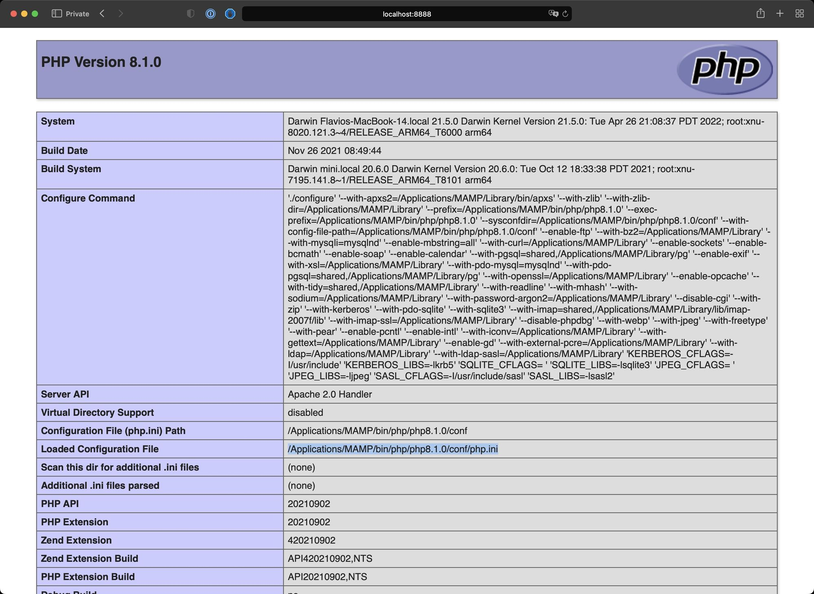

No meu caso está em `/Applications/MAMP/bin/php/php8.1.0/conf/php.ini`.

Note que a informação gerada por `phpinfo()` contém muitas outras informações úteis. Lembre-se disso.

Usando o MAMP você pode abrir a pasta do aplicativo MAMP e abrir `bin/php`. Vá em sua versão específica do PHP (8.1.0 no meu caso) então vá em `conf`. Lá você encontrará o arquivo `php.ini`:

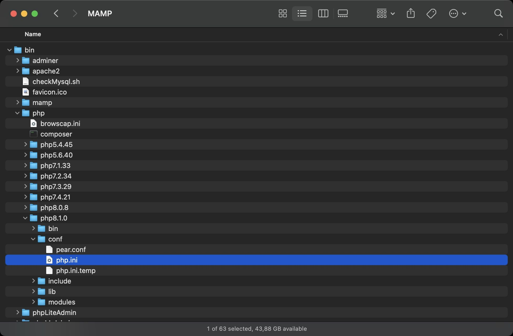

Abra esse arquivo em um editor.

Ele contém uma lista realmente longa de configurações, com uma ótima documentação embutida para cada uma.

Estamos particularmente interessados em `display_errors`:

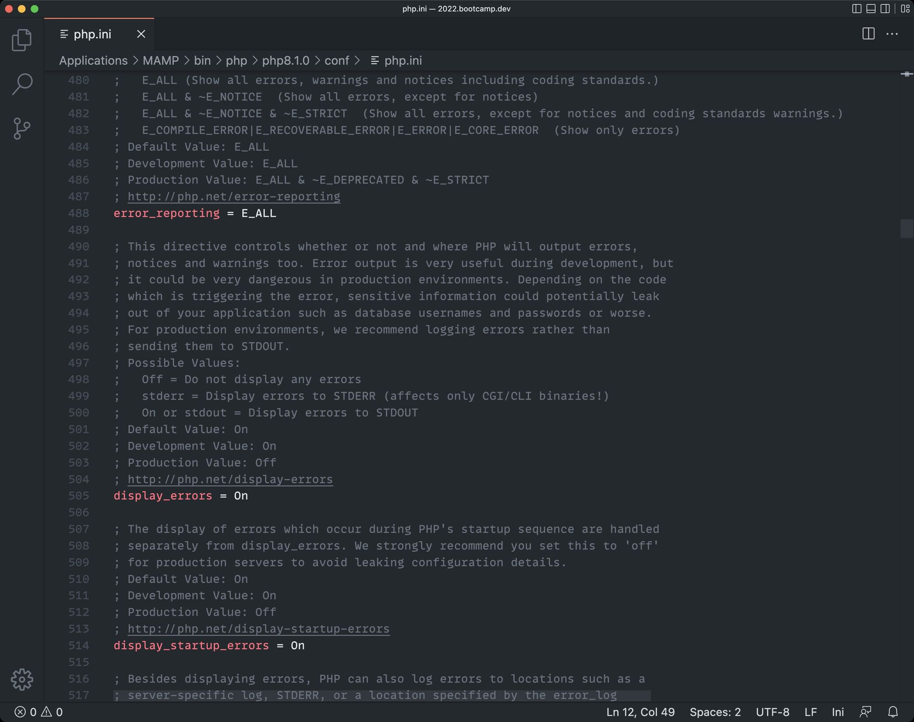

Em produção, você quer que seu valor seja 'Off', como dizem os documentos acima.

Os erros não aparecerão mais no site, mas você os verá no arquivo `php_error.log` na pasta `logs` do MAMP neste caso:

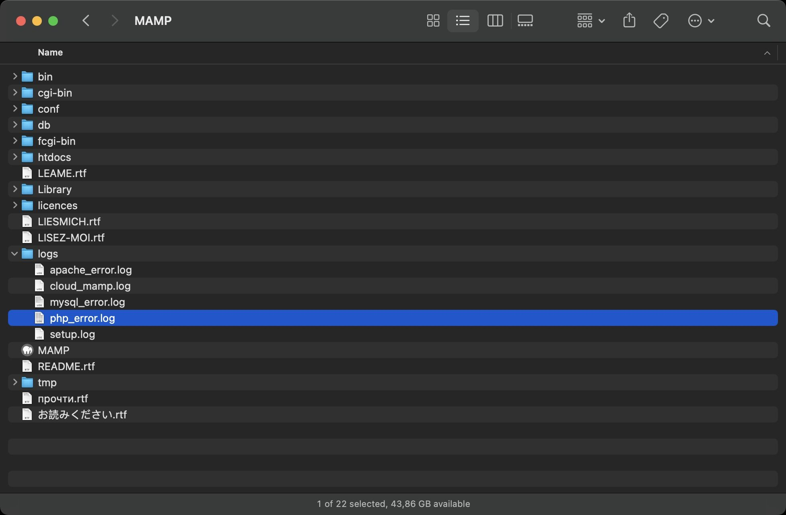

Este arquivo estará em uma pasta diferente dependendo da sua configuração.

Você define este local em seu `php.ini`:

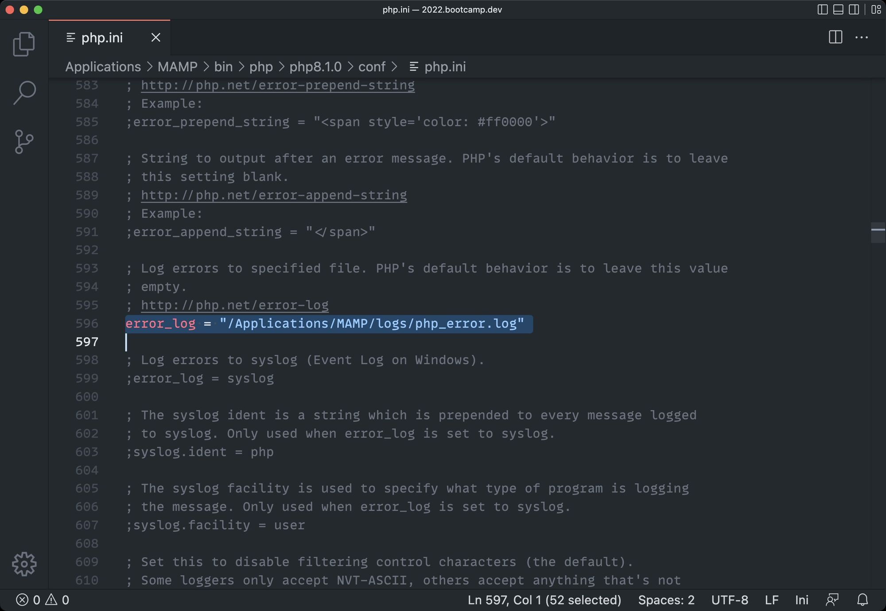

O log de erros conterá todas as mensagens de erro que seu aplicativo gera:

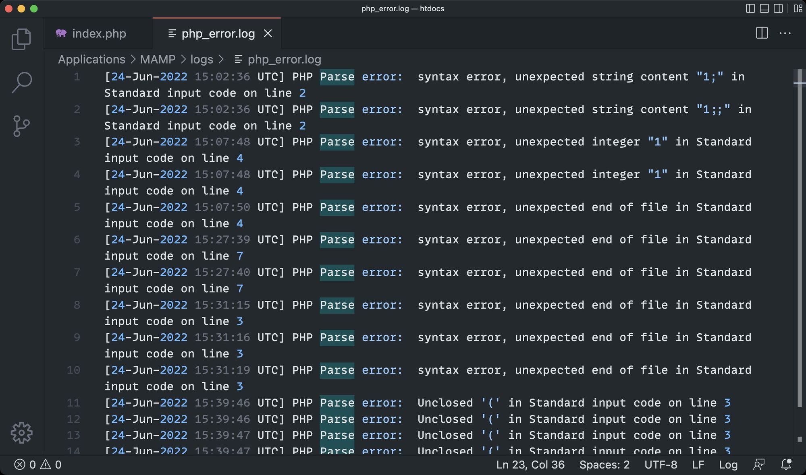

Você pode adicionar informações ao log de erros usando a função [`error_log()`](https://www.php.net/manual/en/function.error-log.php):
```php
error_log('test');
``` 

É comum usar um serviço de logger para erros, como [Monolog](https://github.com/Seldaek/monolog).

Como lidar com exceções em PHP
-------------------------------

Às vezes, os erros são inevitáveis. Como se algo completamente imprevisível acontecesse.

Mas muitas vezes, podemos pensar no futuro e escrever um código que possa interceptar um erro e fazer algo sensato quando isso acontecer. Como mostrar uma mensagem de erro útil para o usuário ou tentar uma solução alternativa.

Fazemos isso usando **exceções**.

Exceções são usadas para nos tornar, desenvolvedores, cientes de um problema.

Envolvemos algum código que pode potencialmente gerar uma exceção em um bloco `try`, e temos um bloco `catch` logo após isso. Esse bloco catch será executado se houver uma exceção no bloco try:
```php
try {
  //faça alguma coisa
} catch (Throwable $e) {
  //podemos fazer algo aqui se uma exceção acontecer
}
```    

Observe que temos um objeto `Exception $e` sendo passado para o bloco `catch`, e podemos inspecionar esse objeto para obter mais informações sobre a exceção, assim:
```php
try {
  //faça alguma coisa
} catch (Throwable $e) {
  echo $e->getMessage();
}
```    

Vejamos um exemplo.

Digamos que por engano eu divida um número por zero:
```php
echo 1 / 0;
```    

Isso acionará um erro fatal e o programa será interrompido nessa linha:

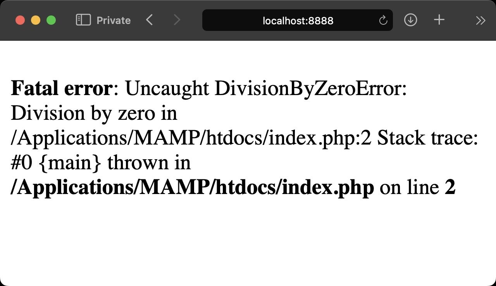

Envolvendo a operação em um bloco try e imprimindo a mensagem de erro no bloco catch, o programa termina com sucesso, informando o problema:
```php
try {
  echo 1 / 0;
} catch (Throwable $e) {
  echo $e->getMessage();
}
```    

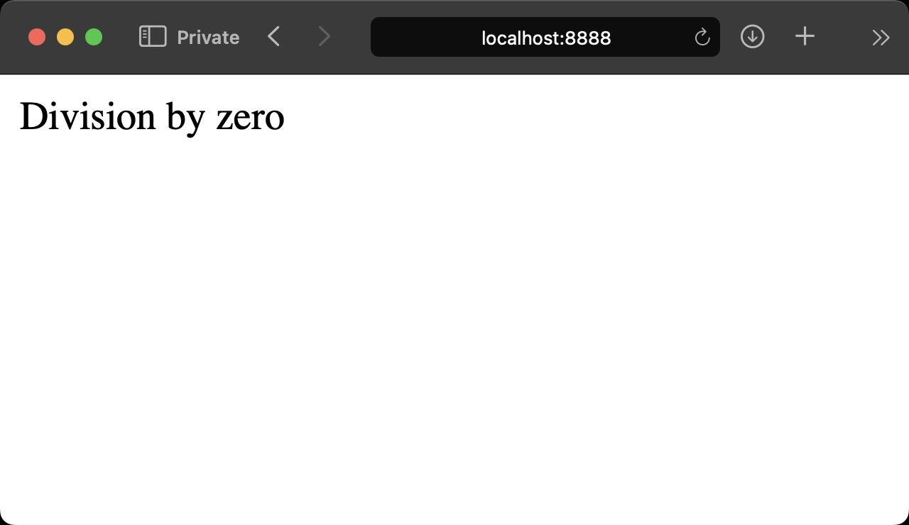

Claro que este é um exemplo simples, mas você pode ver o benefício: eu posso interceptar o problema.

Cada exceção tem uma classe diferente. Por exemplo, podemos pegar isso com o [`DivisionByZeroError`](https://www.php.net/manual/en/class.divisionbyzeroerror.php) e isso me permite filtrar os possíveis problemas e tratá-los de forma diferente.

Eu posso ter um catch-all para qualquer erro jogável no final, assim:
```php
try {
  echo 1 / 0;
} catch (DivisionByZeroError $e) {
  echo 'Ooops I divided by zero!';
} catch (Throwable $e) {
  echo $e->getMessage();
}
```    

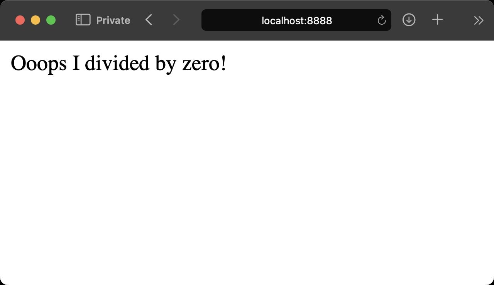

E também posso anexar um bloco `finally {}` no final desta estrutura try/catch para executar algum código depois que o código for executado com sucesso sem problemas ou houve um _catch_:
```php
try {
  echo 1 / 0;
} catch (DivisionByZeroError $e) {
  echo 'Ooops I divided by zero!';
} catch (Throwable $e) {
  echo $e->getMessage();
} finally {
  echo ' ...done!';
}
```    

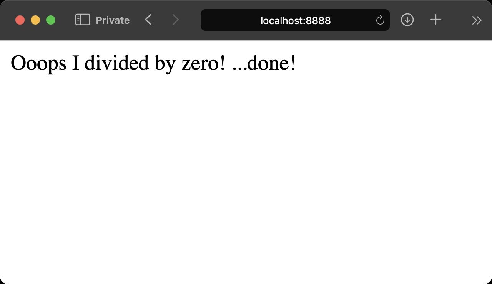

Você pode usar as [exceções incorporadas](https://www.php.net/manual/en/reserved.exceptions.php) fornecidas pelo PHP, mas também pode criar suas próprias exceções.

Como trabalhar com datas em PHP
-----------------------------

Trabalhar com datas e horas é muito comum na programação. Vamos ver o que o PHP oferece.

Podemos obter o timestamp atual (número de segundos desde 1º de janeiro de 1970 00:00:00 GMT) usando [`time()`](https://www.php.net/manual/en/function.time.php):
```php
$timestamp = time();
```    

Quando você tem um timestamp de data/hora, você pode formatá-lo como uma data usando [`date()`](https://www.php.net/manual/en/function.date.php), no formato que preferir:
```php
echo date('Y-m-d', $timestamp);
```    

`Y` é a representação de 4 dígitos do ano, `m` é o número do mês (com um zero à esquerda) e `d` é o número do dia do mês, com um zero à esquerda.

Veja a [lista completa de caracteres que você pode usar para formatar a data aqui](https://www.php.net/manual/en/datetime.format.php).

Podemos converter qualquer data em um timestamp usando [`strtotime()`](https://www.php.net/manual/en/function.strtotime.php), que recebe uma string com uma representação textual de uma data e converte para o número de segundos desde 1º de janeiro de 1970:
```php
echo strtotime('now');
echo strtotime('4 May 2020');
echo strtotime('+1 day');
echo strtotime('+1 month');
echo strtotime('last Sunday');
```

...é bastante flexível.

Para datas, é comum usar bibliotecas que oferecem muito mais funcionalidades do que a linguagem pode oferecer. Uma boa opção é [Carbon](https://carbon.nesbot.com).

Como usar constantes e enums em PHP
-------------------------------------

Podemos definir constantes em PHP usando a função interna `define()`:
```php
define('TEST', 'some value');
```

E então podemos usar `TEST` como se fosse uma variável, mas sem o sinal `$`:
```php
define('TEST', 'some value');

echo TEST;
```    

Usamos identificadores maiúsculos como uma convenção para constantes.

Curiosamente, dentro das classes podemos definir propriedades constantes usando a palavra-chave `const`:
```php
class Dog {
  const BREED = 'Siberian Husky';
}
```    

Por padrão eles são `públicos` mas podemos marcá-los como `privados` ou `protegidos`:
```php
class Dog {
  private const BREED = 'Siberian Husky';
}
```    

Enums permitem que você agrupe constantes sob uma “raiz” comum. Por exemplo, você quer ter um enum `Status` que tenha 3 estados: `EATING` `SLEEPING` `RUNNING`, os 3 estados do dia de um cachorro.

Então você tem:
```php
enum Status {
  case EATING;
  case SLEEPING;
  case RUNNING;
}
```    

Agora podemos referenciar essas constantes desta forma:
```php
class Dog {
  public Status $status;
}

$dog = new Dog();

$dog->status = Status::RUNNING;

if ($dog->status == Status::SLEEPING) {
  //...
}
```    

Enums são objetos, eles podem ter métodos e muito mais recursos do que podemos abordar aqui nesta breve introdução.

Como usar o PHP como uma plataforma de desenvolvimento de aplicações Web
------------------------------------------------

PHP é uma linguagem do lado do servidor e normalmente é usada de duas maneiras.

Um está dentro de uma página HTML, então o PHP é usado para “adicionar” coisas ao HTML que é definido manualmente no arquivo `.php`. Esta é uma maneira perfeitamente boa de usar o PHP.

Outra forma considera o PHP mais como o motor que é responsável por gerar uma “aplicação”. Você não escreve o HTML em um arquivo `.php`, mas usa uma linguagem de modelagem para gerar o HTML, e tudo é gerenciado pelo que chamamos de **framework**.

Isso é o que acontece quando você usa um framework moderno como o Laravel.

Eu consideraria a primeira maneira um pouco “fora de moda” nos dias de hoje, e se você está apenas começando, deve conhecer esses dois estilos diferentes de uso do PHP.

Mas também considere usar um framework como “modo fácil” porque os frameworks fornecem ferramentas para lidar com roteamento, ferramentas para acessar dados de um banco de dados e facilitam a criação de uma aplicação mais segura. E eles tornam tudo mais rápido para desenvolver.

Dito isso, não vamos falar sobre o uso de frameworks neste manual. Mas vou falar sobre os blocos de construção básicos e fundamentais do PHP. Eles são essenciais que qualquer desenvolvedor PHP deve saber.

Apenas saiba que “no mundo real” você pode usar a maneira de fazer as coisas do seu framework favorito, em vez dos recursos de _nível inferior_ oferecidos pelo PHP.

Isso não se aplica apenas ao PHP, é claro – é um “problema” que acontece com qualquer linguagem de programação.

### Como lidar com solicitações HTTP em PHP

Vamos começar com o tratamento de solicitações HTTP.

O PHP oferece roteamento baseado em arquivo por padrão. Você cria um arquivo `index.php` e isso responde no caminho `/`.

Vimos isso quando fizemos o exemplo Hello World no começo.

Da mesma forma, você pode criar um arquivo `test.php` e automaticamente esse será o arquivo que o Apache servirá na rota `/test`.

### Como usar `$_GET`, `$_POST` e `$_REQUEST` no PHP

Os arquivos respondem a todas as solicitações HTTP, incluindo GET, POST e outros verbos.

Para qualquer solicitação, você pode acessar todos os dados da string de consulta usando o objeto `$_GET`. Chama-se _superglobal_ e está automaticamente disponível em todos os nossos arquivos PHP.

Obviamente, isso é mais útil em solicitações GET, mas também outras solicitações podem enviar dados como uma string de consulta.

Para solicitações POST, PUT e DELETE, é mais provável que você precise dos dados postados como dados codificados por URL ou usando o objeto FormData, que o PHP disponibiliza para você usando `$_POST`.

Há também `$_REQUEST` que contém todos os `$_GET` e `$_POST` combinados em uma única variável.

### Como usar o objeto `$_SERVER` em PHP

Também temos a variável superglobal `$_SERVER`, que você usa para obter muitas informações úteis.

Você viu como usar `phpinfo()` antes. Vamos usá-lo novamente para ver o que $\_SERVER nos oferece.

No seu arquivo `index.php` na raiz do MAMP execute:
```php
<?php
phpinfo();
?>
```    

Em seguida, gere a página em [localhost:8888](http://localhost:8888) e pesquise `$_SERVER`. Você verá toda a configuração armazenada e os valores atribuídos:

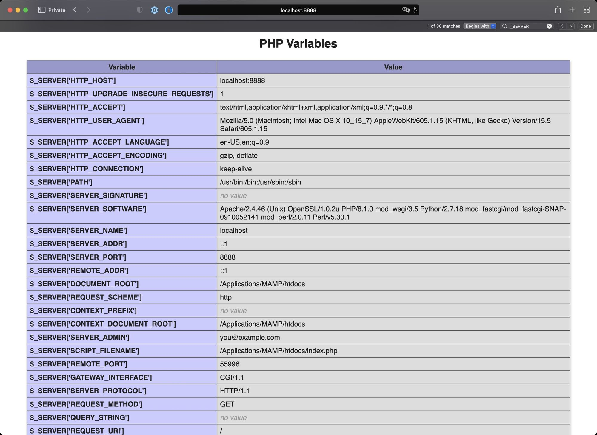

Os importantes que você pode usar são:

*   `$_SERVER['HTTP_HOST']`
*   `$_SERVER['HTTP_USER_AGENT']`
*   `$_SERVER['SERVER_NAME']`
*   `$_SERVER['SERVER_ADDR']`
*   `$_SERVER['SERVER_PORT']`
*   `$_SERVER['DOCUMENT_ROOT']`
*   `$_SERVER['REQUEST_URI']`
*   `$_SERVER['SCRIPT_NAME']`
*   `$_SERVER['REMOTE_ADDR']`

### How to Use Forms in PHP

Forms are the way the Web platform allows users to interact with a page and send data to the server.

Here is a simple form in HTML:
```html
<form>
  <input type="text" name="name" />
  <input type="submit" />
</form>
```    

You can put this in your `index.php` file like it was called `index.html`.

A PHP file assumes you write HTML in it with some “PHP sprinkles” using `<?php ?>` so the Web Server can post that to the client. Sometimes the PHP part takes all of the page, and that’s when you generate all the HTML via PHP – it’s kind of the opposite of the approach we're taking here now.

So we have this `index.php` file that generates this form using plain HTML:

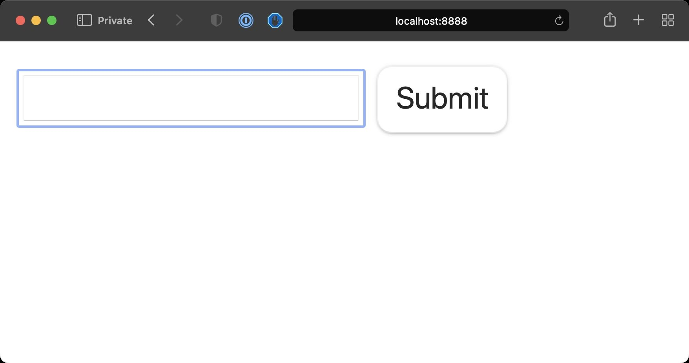

Pressing the Submit button will make a GET request to the same URL sending the data via query string. Notice that the URL changed to [localhost:8888/?name=test](http://localhost:8888/?name=test).

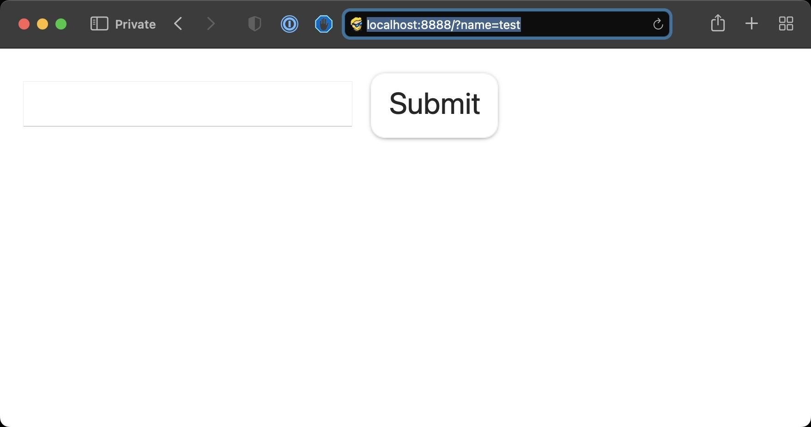

We can add some code to check if that parameter is set using the [`isset()`](https://www.php.net/manual/en/function.isset.php) function:
```php
<form>
  <input type="text" name="name" />
  <input type="submit" />
</form>

<?php
if (isset($_GET['name'])) {
  echo '<p>The name is ' . $_GET['name'];
}
?>
```    

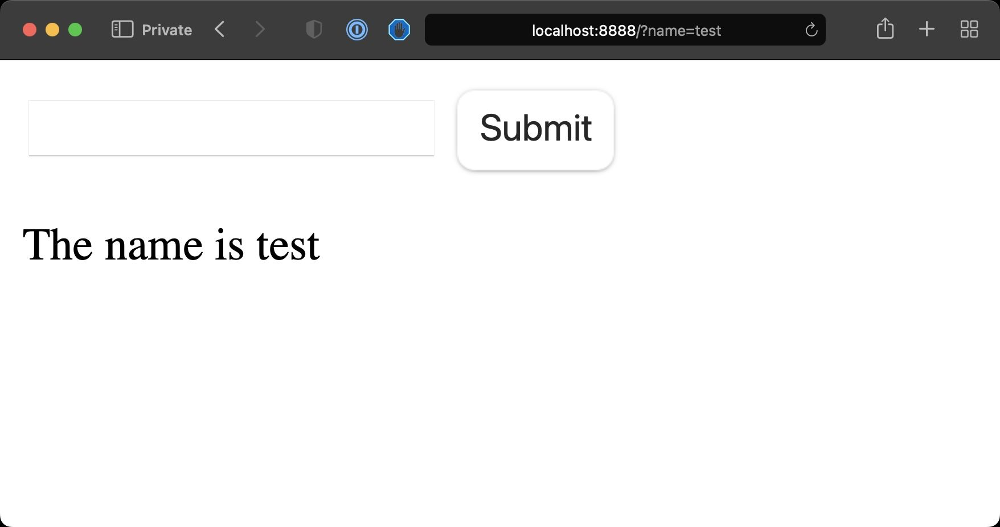

See? We can get the information from the [GET request](https://developer.mozilla.org/en-US/docs/Web/HTTP/Methods/GET) query string through `$_GET`.

What you usually do with forms, though is you perform a POST request:
```php
<form method="POST">
  <input type="text" name="name" />
  <input type="submit" />
</form>

<?php
if (isset($_POST['name'])) {
  echo '<p>The name is ' . $_POST['name'];
}
?>
```    

See, now we got the same information but the URL didn’t change. The form information was not appended to the URL.

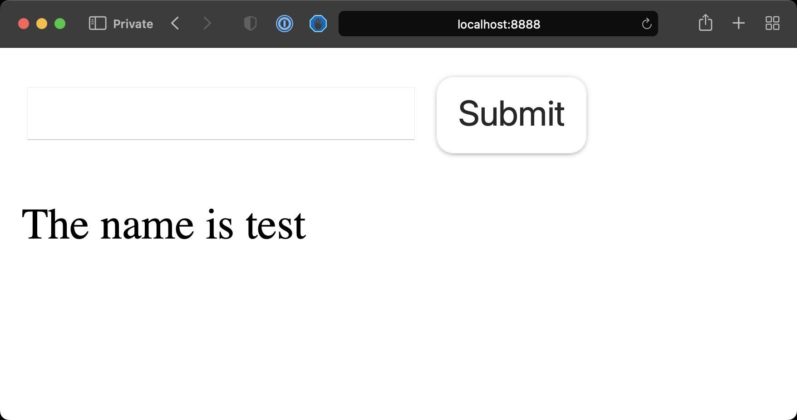

This is because we’re using a [POST request](https://developer.mozilla.org/en-US/docs/Web/HTTP/Methods/POST), which sends the data to the server in a different way, through URL-encoded data.

As mentioned above, PHP will still serve the `index.php` file as we’re still sending data to the same URL the form is on.

We’re mixing a bunch of code and we could separate the form request handler from the code that generates the form.

So we can have this in `index.php`:
```html
<form method="POST" action="/post.php">
  <input type="text" name="name" />
  <input type="submit" />
</form>
```    

and we can create a new `post.php` file with:
```php
<?php
if (isset($_POST['name'])) {
  echo '<p>The name is ' . $_POST['name'];
}
?>
```    

PHP will display this content now after we submit the form, because we set the `action` HTML attribute on the form.

This example is very simple, but the `post.php` file is where we could, for example, save the data to the database, or to a file.

### How to Use HTTP Headers in PHP

PHP lets us set the HTTP headers of a response through the `header()` function.

[HTTP Headers](https://flaviocopes.com/http-request-headers/) are a way to send information back to the browser.

We can say the page generates a 500 Internal Server Error:
```php
<?php
header('HTTP/1.1 500 Internal Server Error');
?>
```    

Now you should see the status if you access the page with the [Browser Developer Tools](https://flaviocopes.com/browser-dev-tools/) open:

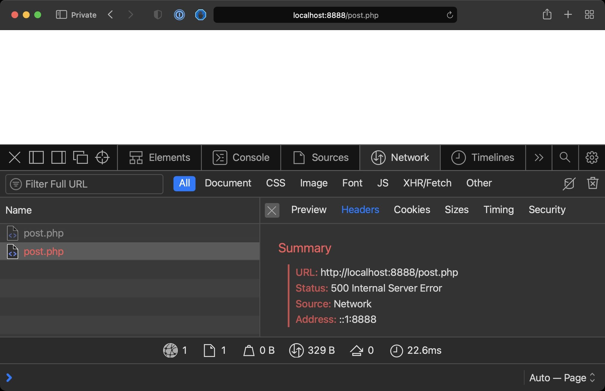

We can set the `content/type` of a response:
```php
header('Content-Type: text/json');
```    

We can force a 301 redirect:
```php
header('HTTP/1.1 301 Moved Permanently');
header('Location: https://flaviocopes.com');
```    

We can use headers to say to the browser “cache this page”, “don’t cache this page”, and a lot more.

### How to Use Cookies in PHP

Cookies are a browser feature.

When we send a response to the browser, we can set a cookie which will be stored by the browser, client-side.

Then, every request the browser makes will include the cookie back to us.

We can do many things with cookies. They are mostly used to create a personalized experience without you having to login to a service.

It’s important to note that cookies are domain-specific, so we can only read cookies we set on the current domain of our application, not other application’s cookies.

But JavaScript can read cookies (unless they are _HttpOnly cookies_ but we’re starting to go into a rabbit hole) so cookies should not store any sensitive information.

We can use PHP to read the value of a cookie referencing the `$_COOKIE` superglobal:
```php
if (isset($_COOKIE['name'])) {
  $name = $_COOKIE['name'];
}
```    

The [`setcookie()`](https://www.php.net/manual/en/function.setcookie.php) function allows you to set a cookie:
```php
setcookie('name', 'Flavio');
```

We can add a third parameter to say when the cookie will expire. If omitted, the cookie expires at the end of the session/when the browser is closed.

Use this code to make the cookie expire in 7 days:
```php
setcookie('name', 'Flavio', time() + 3600 * 24 * 7);
```

We can only store a limited amount of data in a cookie, and users can clear the cookies client-side when they clear the browser data.

Also, they are specific to the browser / device, so we can set a cookie in the user’s browser, but if they change browser or device, the cookie will not be available.

Let’s do a simple example with the form we used before. We’re going to store the name entered as a cookie:
```php
<?php
if (isset($_POST['name'])) {
  setcookie('name', $_POST['name']);
}
if (isset($_POST['name'])) {
  echo '<p>Hello ' . $_POST['name'];
} else {
  if (isset($_COOKIE['name'])) {
    echo '<p>Hello ' . $_COOKIE['name'];
  }
}
?>

<form method="POST">
  <input type="text" name="name" />
  <input type="submit" />
</form>
```    

I added some conditionals to handle the case where the cookie was already set, and to display the name right after the form is submitted, when the cookie is not set yet (it will only be set for the next HTTP request).

If you open the Browser Developer Tools you should see the cookie in the Storage tab.

From there you can inspect its value, and delete it if you want.

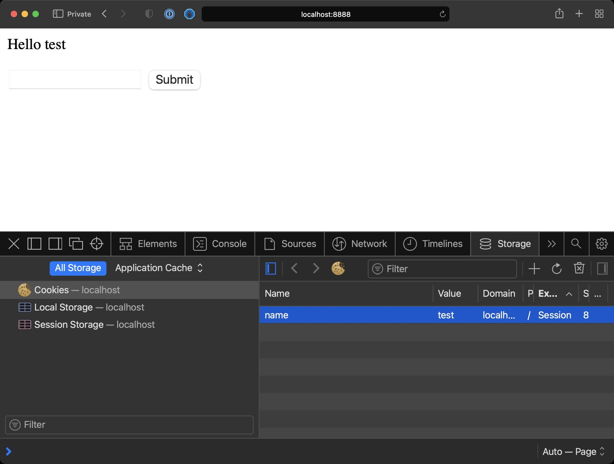

### How to Use Cookie-based Sessions in PHP

One very interesting use case for cookies is cookie-based sessions.

PHP offers us a very easy way to create a cookie-based session using `session_start()`.

Try adding this:
```php
<?php
session_start();
?>
```    

in a PHP file, and load it in the browser.

You will see a new cookie named by default `PHPSESSID` with a value assigned.

That’s the session ID. This will be sent for every new request and PHP will use that to identify the session.


Similarly to how we used cookies, we can now use `$_SESSION` to store the information sent by the user – but this time it’s not stored client-side.

Only the session ID is.

The data is stored server-side by PHP.
```php
<?php
session_start();

if (isset($_POST['name'])) {
  $_SESSION['name'] = $_POST['name'];
}
if (isset($_POST['name'])) {
  echo '<p>Hello ' . $_POST['name'];
} else {
  if (isset($_SESSION['name'])) {
    echo '<p>Hello ' . $_SESSION['name'];
  }
}
?>

<form method="POST">
  <input type="text" name="name" />
  <input type="submit" />
</form>
```    

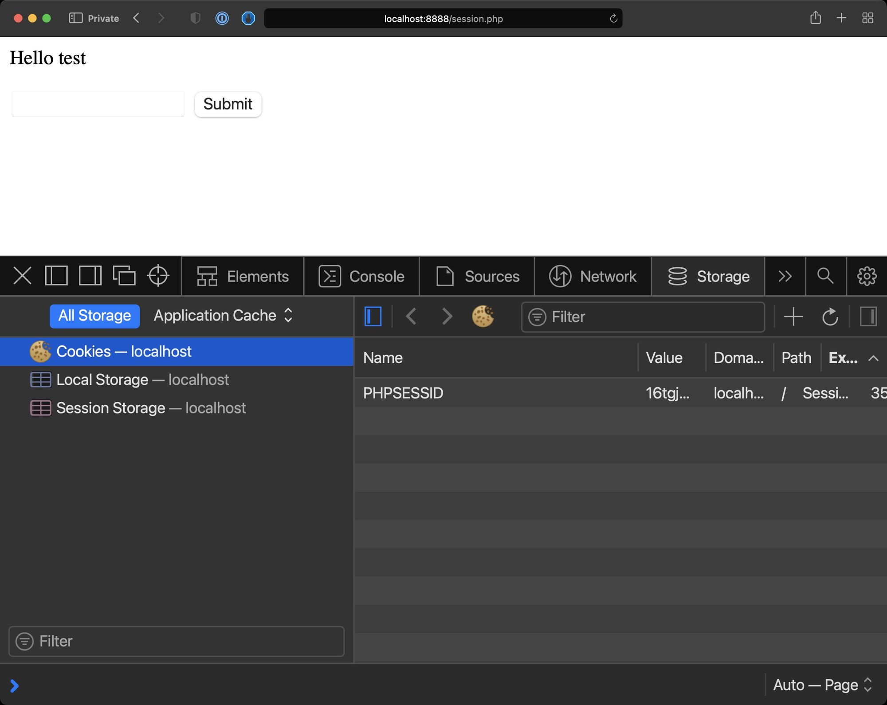

This works for simple use cases, but of course for intensive data you will need a database.

To clear the session data you can call `session_unset()`.

To clear the session cookie use:
```php
setcookie(session_name(), '');
```    

### How to Work with Files and Folders in PHP

PHP is a server-side language, and one of the handy things it provides is access to the filesystem.

You can check if a file exists using `file_exists()`:
```php
file_exists('test.txt') //true
```    

Get the size of a file using `filesize()`:
```php
filesize('test.txt')
```

You can open a file using `fopen()`. Here we open the `test.txt` file in **read-only mode** and we get what we call a **file descriptor** in `$file`:
```php
$file = fopen('test.txt', 'r')
```

We can terminate the file access by calling `fclose($fd)`.

Read the content of a file into a variable like this:
```php
$file = fopen('test.txt', 'r')

fread($file, filesize('test.txt'));

//or

while (!feof($file)) {
  $data .= fgets($file, 5000);
}
```

`feof()` checks that we haven’t reached the end of the file as `fgets` reads 5000 bytes at a time.

You can also read a file line by line using `fgets()`:
```php
$file = fopen('test.txt', 'r')

while(!feof($file)) {
  $line = fgets($file);
  //do something
}
```

To write to a file you must first open it in **write mode**, then use `fwrite()`:
```php
$data = 'test';
$file = fopen('test.txt', 'w')
fwrite($file, $data);
fclose($file);
```

We can delete a file using `unlink()`:
```php
unlink('test.txt')
```  

Those are the basics, but of course there are [more functions to work with files](https://www.php.net/manual/en/ref.filesystem.php).

### PHP and Databases

PHP offers various built-in libraries to work with databases, for example:

*   [PostgreSQL](https://www.php.net/manual/en/book.pgsql.php)
*   [MySQL](https://www.php.net/manual/en/set.mysqlinfo.php) / MariaDB
*   [MongoDB](https://www.php.net/manual/en/set.mongodb.php)

I won't cover this in the handbook because I think this is a big topic and one that would also require you to learn SQL.

I am also tempted to say that if you need a database you should use a framework or ORM that would save you security issues with SQL injection. [Laravel’s Eloquent](https://laravel.com/docs/eloquent) is a great example.

### How to Work with JSON in PHP

[JSON](https://flaviocopes.com/json/) is a portable data format we use to represent data and send data from client to server.

Here’s an example of a JSON representation of an object that contains a string and a number:
```json
{
  "name": "Flavio",
  "age": 35
}
``` 

PHP offers us two utility functions to work with JSON:

*   `json_encode()` to encode a variable into JSON
*   `json_decode()` to decode a JSON string into a data type (object, array…)

Example:
```php
$test = ['a', 'b', 'c'];

$encoded = json_encode($test); // "["a","b","c"]" (a string)

$decoded = json_decode($encoded); // [ "a", "b", "c" ] (an array)
```

### How to Send Emails with PHP

One of the things that I like about PHP is the conveniences, like sending an email.

Send an email using [`mail()`](https://www.php.net/manual/en/function.mail.php):
```php
mail('test@test.com', 'this subject', 'the body');
```

To send emails at scale we can’t rely on this solution, as these emails tend to reach the spam folder more often than not. But for quick testing this is just helpful.

Libraries like [https://github.com/PHPMailer/PHPMailer](https://github.com/PHPMailer/PHPMailer) will be super helpful for more solid needs, using an SMTP server.

How to Use Composer and Packagist
---------------------------------

[Composer](https://getcomposer.org) is the package manager of PHP.

It allows you to easily install packages into your projects.

Install it on your machine ([Linux/Mac](https://getcomposer.org/doc/00-intro.md#installation-linux-unix-macos) or [Windows](https://getcomposer.org/doc/00-intro.md#installation-windows)) and once you’re done you should have a `composer` command available on your terminal.

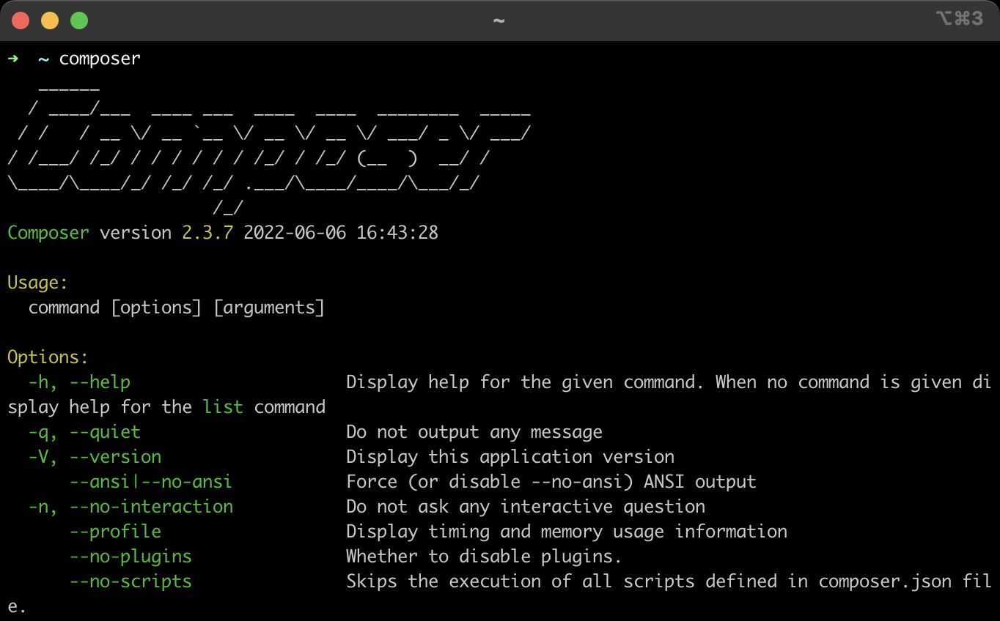

Now inside your project you can run `composer require <lib>` and it will be installed locally. For example let's install [the Carbon library](https://carbon.nesbot.com) that helps us work with dates in PHP
```bash
composer require nesbot/carbon
```

It will do some work:

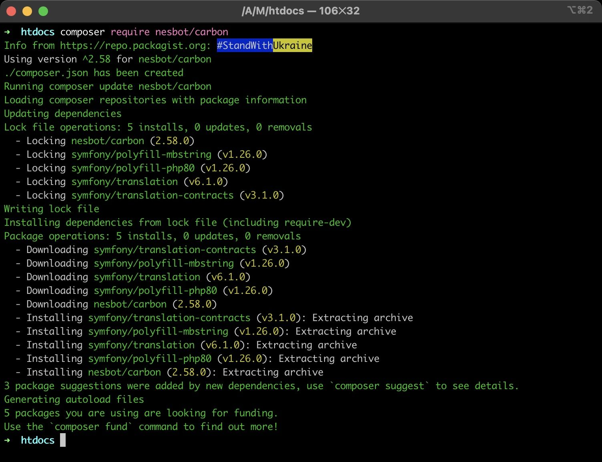

Once it’s done, you will find some new things in the folder `composer.json` that lists the new configuration for the dependencies:
```json
{
    "require": {
        "nesbot/carbon": "^2.58"
    }
}
```

`composer.lock` is used to “lock” the versions of the package in time, so the exact same installation you have can be replicated on another server. The `vendor` folder contains the library just installed and its dependencies.

Now in the `index.php` file we can add this code at the top:
```php
<?php
require 'vendor/autoload.php';

use Carbon\Carbon;
```

and then we can use the library!
```php
echo Carbon::now();
```

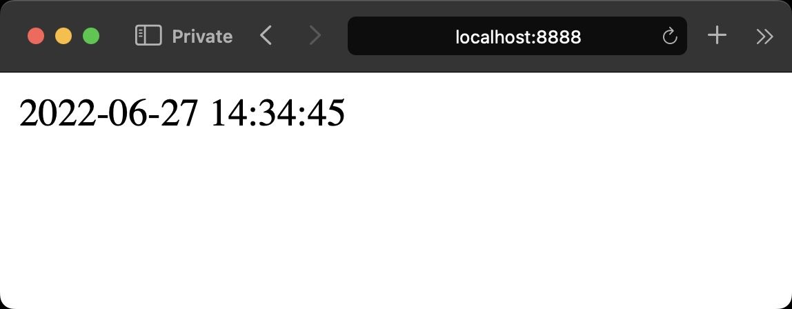

See? We didn’t have to manually download a package from the internet and install it somewhere...it was all fast, quick, and well organized.

The `require 'vendor/autoload.php';` line is what enables **autoloading**. Remember when we talked about `require_once()` and `include_once()`? This solves all of that – we don’t need to manually search for the file to include, we just use the `use` keyword to import the library into our code.

How to Deploy a PHP Application
-------------------------------

When you’ve got an application ready, it’s time to deploy it and make it accessible from anyone on the Web.

PHP is the programming language with the best deployment _story_ across the Web.

Trust me, every single other programming language and ecosystem wishes they were as easy as PHP.

The great thing about PHP, the thing it got _right_ and allowed it to have the incredible success it has had, is the instant deploy.

You put a PHP file on a folder served by a Web server, and _voilà_ – it just works.

No need to restart the server, run an executable, nothing.

This is still something that a lot of people do. You get a shared hosting for $3/month, upload your files via FTP, and you're done.

These days, though, I think Git deploy is something that should be baked into every project, and shared hosting should be a thing of the past.

One solution is always having your own private VPS (Virtual Private Server), which you can get from services like DigitalOcean or Linode.

But managing your own VPS is no joke. It requires serious knowledge and time investment, and constant maintenance.

You can also use the so-called PaaS (Platform as a Service), which are platforms that focus on taking care of all the boring stuff (managing servers) and you just upload your app and it runs.

Solutions like **DigitalOcean App Platform** (which is different from a DigitalOcean VPS), Heroku, and many others are great for your first tests.

These services allow you to connect your GitHub account and deploy any time you push a new change to your [Git](https://flaviocopes.com/git/) repository.

You can learn [how to setup Git and GitHub from zero here](https://flaviocopes.com/github-setup-from-zero/).

This is a much better workflow compared to FTP uploads.

Let’s do a bare bones example.

I created a simple PHP application with just an `index.php` file:
```php
<?php
echo 'Hello!';
?>
```

I add the parent folder to my GitHub Desktop app, I initialize a Git repo, and I push it to GitHub:

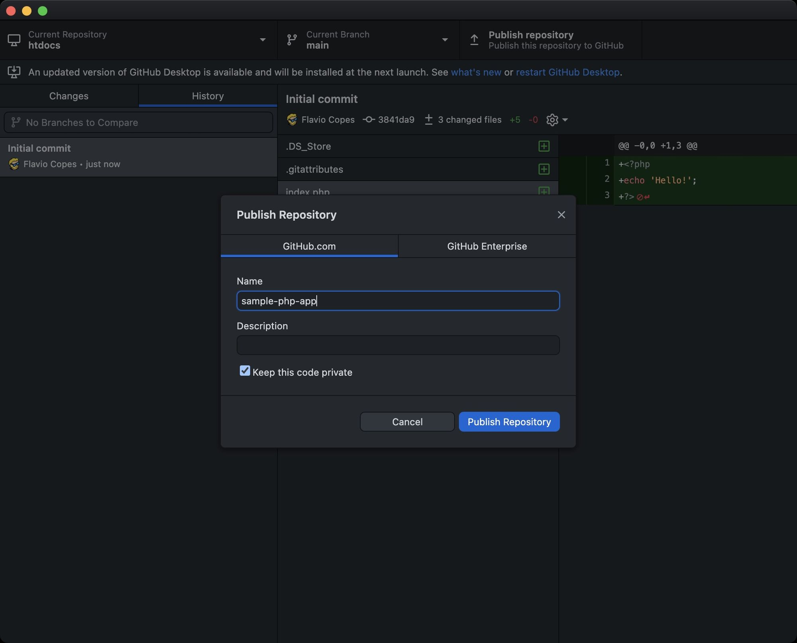

Now go on [digitalocean.com](http://digitalocean.com).

If you don’t have an account yet, [use my referral code to sign up get $100 free credits over the next 60 days](https://m.do.co/c/bd0657b4877c) and you can work on your PHP app for free.

I connect to my DigitalOcean account and I go to Apps → Create App.

I connect my GitHub Account and select the repo of my app.

Make sure “Autodeploy” is checked, so the app will automatically redeploy on changes:

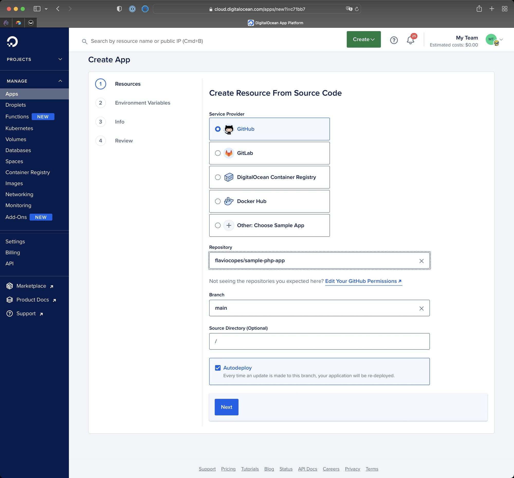

Click “Next” then Edit Plan:


By default the Pro plan is selected.

Use Basic and pick the $5/month plan.

Note that you pay $5 per month, but billing is per hour – so you can stop the app any time you want.


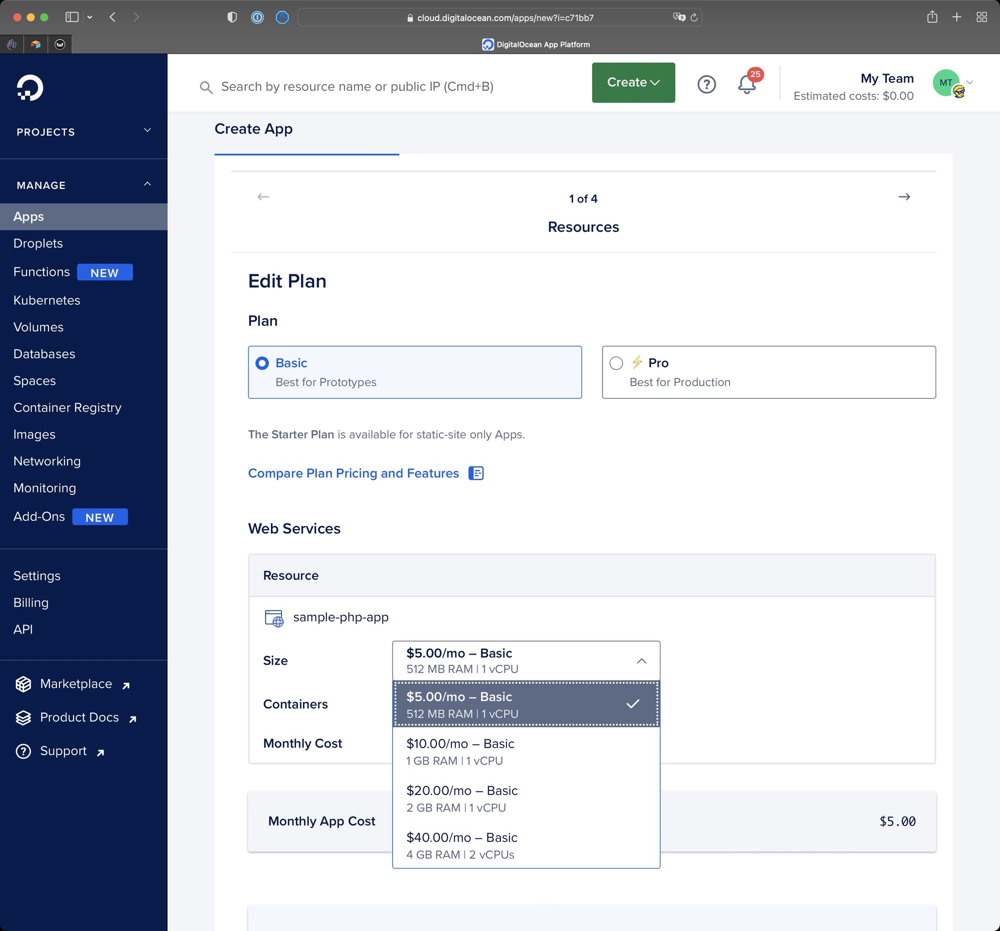

Then go back and press “Next” until the “Create Resources” button appears to create the app. You don’t need any database, otherwise that would be another $7/month on top.


Now wait until the deployment is ready:

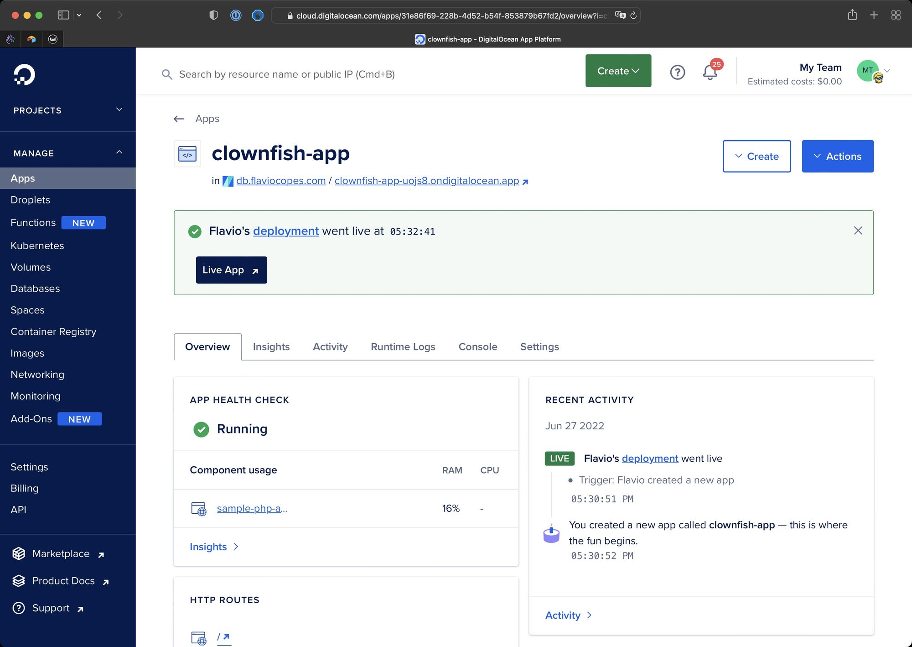

The app is now up and running!

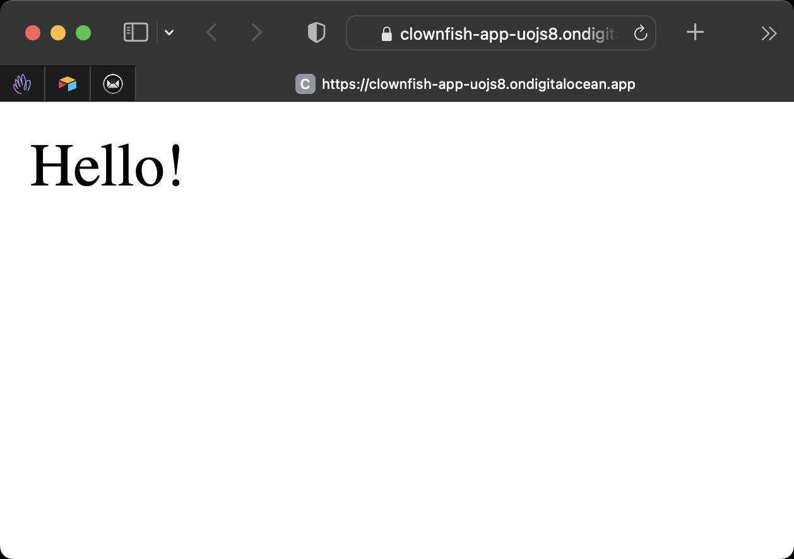

Conclusion
----------

You’ve reached the end of the PHP Handbook!

Thank you for reading through this introduction to the wonderful world of PHP development. I hope it will help you get your web development job, become better at your craft, and empower you to work on your next big idea.

Note: you can get a [PDF, ePub, or Mobi](https://thevalleyofcode.com/download/php/) version of this handbook for easier reference, or for reading on your Kindle or tablet.