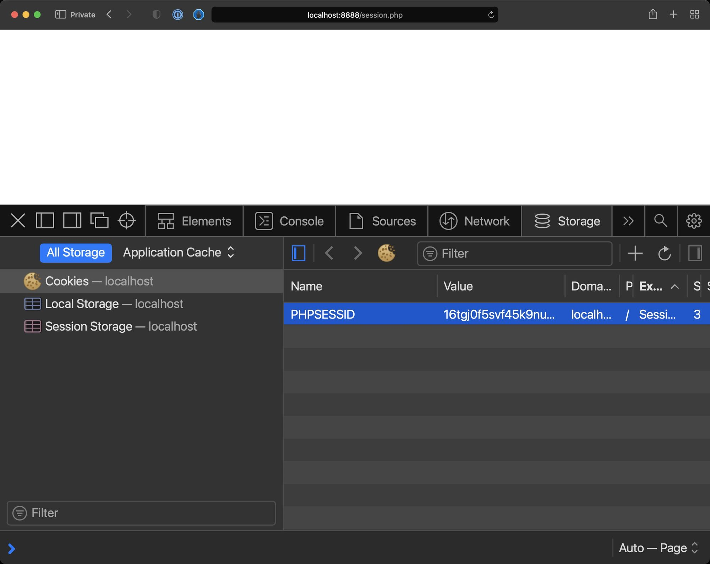
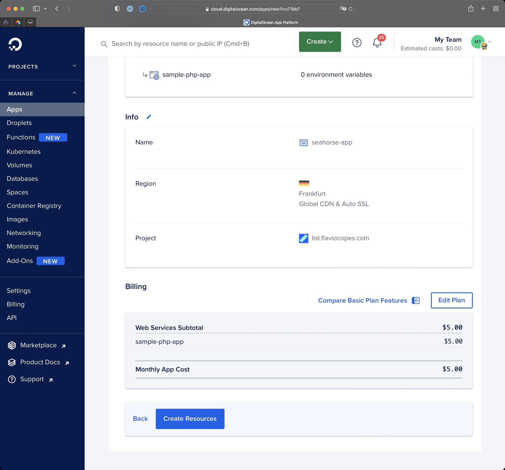

# THE PHP HANDBOOK

> Esta é uma tradução do artigo original de Flavio Copes em https://www.freecodecamp.org/news/the-php-handbook

> Traduzido por [Fernando Wobeto](https://www.fernandowobeto.com)

PHP é uma incrível e popular linguagem de programação.

As estatísticas dizem que ela é usada por 80% de todos os sites. 

Statistics say it’s used by 80% of all websites. É a linguagem que alimenta o WordPress, o sistema de gerenciamento de conteúdo amplamente utilizado para sites.

E também alimenta muitos frameworks diferentes que facilitam o desenvolvimento da Web, como o Laravel. Falando em Laravel, pode ser uma das razões mais convincentes para aprender PHP nos dias de hoje.

Porque aprender PHP?
--------------

PHP é uma linguagem bastante polarizadora. Algumas pessoas adoram, e algumas pessoas odeiam. Se dermos um passo acima das emoções e olharmos para a linguagem como uma ferramenta, o PHP tem muito a oferecer.

Claro que não é perfeita. Mas deixe-me dizer-lhe – nenhuma linguagem é.

Neste manual, vou ajudá-lo a aprender PHP.

Este manual é uma introdução perfeita se você é novo na linguagem. Também é perfeito se você já fez “algum PHP” no passado e deseja voltar a ele.

Eu vou explicar PHP moderno, versão 8+.

O PHP evoluiu muito nos últimos anos. Então, se a última vez que você tentou foi PHP 5 ou mesmo PHP 4, você ficará surpreso com todas as coisas boas que o PHP oferece agora.

Vamos lá!

Aqui está o que abordaremos neste manual:

1.  [Introdução ao PHP](#introduction-to-php)
2.  [Que tipo de linguagem é o PHP?](#what-kind-of-language-is-php)
3.  [Como configurar o PHP](#how-to-setup-php)
4.  [Como codificar seu primeiro programa em PHP](#how-to-code-your-first-php-program)
5.  [O básico do PHP](#php-language-basics)
6.  [Como trabalhar com Strings no PHP](#how-to-work-with-strings-in-php)
7.  [Como usar funções nativas para números em PHP](#how-to-use-built-in-functions-for-numbers-in-php)
8.  [Como funcionam os arrays em PHP](#how-arrays-work-in-php)
9.  [Como funcionam as condicionais no PHP](#how-conditionals-work-in-php)
10.  [Como funcionam os Loops em PHP](#how-loops-work-in-php)
11.  [Como funcionam as funções em PHP](#how-functions-work-in-php)
12.  [Como fazer um loop através de arrays com `map()`, `filter()`, e `reduce()` no PHP](#id="how-to-loop-through-arrays-with-map-filter-and-reduce-in-php)
13.  [Programação Orientada a Objetos no PHP](#object-oriented-programming-in-php)
14.  [Como incluir outros arquivos PHP](#how-to-include-other-php-files)
15.  [Constantes, funções e variáveis úteis para sistema de arquivos em PHP](#useful-constants-functions-and-variables-for-filesystem-in-php)
16.  [Como lidar com erros em PHP](#how-to-handle-errors-in-php)
17.  [Como lidar com exceções em PHP](#how-to-handle-exceptions-in-php)
18.  [Como trabalhar com datas no PHP](#how-to-work-with-dates-in-php)
19.  [Como usar constantes e enumeradores no PHP](#how-to-use-constants-and-enums-in-php)
20.  [Como usar o PHP como uma plataforma de desenvolvimento de aplicativos da Web](#how-to-use-php-as-a-web-app-development-platform)
21.  [Como usar Composer e Packagist](#how-to-use-composer-and-packagist)
22.  [Como efetuar deploy de uma aplicação PHP](#how-to-deploy-a-php-application)
23.  [Conclusão](#conclusion)


Note que você por pegar uma versão em [PDF, ePub, or Mobi](https://thevalleyofcode.com/download/php/) desse manual para referência mais fácil, ou para leitura no seu Kindle ou table.

Introdução ao PHP
-------------------

PHP é uma linguagem de programação que muitos desenvolvedores usam para criar aplicações web, entre outras coisas.

Como linguagem, teve um começo humilde. Foi criado em 1994 por Rasmus Lerdorf para construir seu site pessoal. Ele não sabia na época que se tornaria uma das linguagens de programação mais populares do mundo. Tornou-se popular mais tarde, em 1997/8, e explodiu nos anos 2000, quando o PHP 4 chegou.

Você pode usar o PHP para adicionar um pouco de interatividade a uma página HTML.

Ou você pode usá-lo como um mecanismo de aplicação Web que cria páginas HTML dinamicamente e as envia para o navegador.

Ele pode ser dimensionado para milhões de visualizações.

Você sabia que o Facebook é alimentado por PHP? Já ouviu falar da Wikipédia? SLack? Etsy?

Que tipo de linguagem é o PHP?
-----------------------------

Vamos entrar em algum jargão técnico.

As linguagens de programação são divididas em grupos, dependendo de suas características. Por exemplo interpretado/compilado, tipado forte/fraca, tipado dinamicamente/estaticamente.

O PHP é frequentemente chamado de “linguagem de script” e é uma **linguagem interpretada**. Se você usou linguagens compiladas como C ou Go ou Swift, a principal diferença é que você não precisa compilar um programa PHP antes de executá-lo.

Essas linguagens são compiladas e o compilador gera um programa executável que você executa. É um processo de 2 etapas.

O PHP _interpreter_ é responsável por interpretar as instruções escritas em um programa PHP quando ele é executado. É apenas um passo. Você diz ao interpretador para executar o programa. É um fluxo de trabalho completamente diferente.

PHP é uma **linguagem tipada dinamicamente**. Os tipos de variáveis ​​são verificados em tempo de execução, e não antes que o código seja executado, como acontece com linguagens de tipagem estática. (Estes também são compilados – as duas características geralmente andam de mãos dadas.)

O PHP também é vagamente (fracamente) tipado. Comparado com linguagens fortemente tipadas como Swift, Go, C ou Java, você não precisa declarar os tipos de suas variáveis.

Ser interpretado e tipado de forma flexível/dinamicamente tornará os bugs mais difíceis de encontrar antes que eles aconteçam em tempo de execução.

Em linguagens compiladas, muitas vezes você pode detectar erros em tempo de compilação, algo que não acontece em linguagens interpretadas.

Mas, por outro lado, uma linguagem interpretada tem mais flexibilidade.

Curiosidade: PHP é escrito internamente em C, uma linguagem compilada e estaticamente tipada.

Em sua natureza, o PHP é semelhante ao JavaScript, outra linguagem dinamicamente tipada, livremente tipada e interpretada.

PHP suporta programação orientada a objetos e também programação funcional. Você pode usar como preferir.

Como configurar o PHP
----------------

Existem muitas maneiras de instalar o PHP em sua máquina local.

A maneira mais conveniente que encontrei para instalar o PHP localmente é usar o MAMP.

MAMP é uma ferramenta que está disponível gratuitamente para todos os sistemas operacionais – Mac, Windows e Linux. É um pacote que lhe dá todas as ferramentas que você precisa para começar a trabalhar.

O PHP é executado por um Servidor HTTP, que é responsável por responder às requisições HTTP, aquelas feitas pelo navegador. Então você acessa uma URL com seu navegador, Chrome ou Firefox ou Safari, e o servidor HTTP responde com algum conteúdo HTML.

O servidor normalmente é Apache ou NGINX.

Então, para fazer qualquer coisa não trivial, você precisará de um banco de dados, como o MySQL.

O MAMP é um pacote que fornece tudo isso e muito mais, e oferece uma interface agradável para iniciar/parar tudo de uma vez.

Claro, você pode configurar cada peça por conta própria, se quiser, e muitos tutoriais explicam como fazer isso. Mas eu gosto de ferramentas simples e práticas, e o MAMP é uma delas.

Você pode seguir este manual com qualquer tipo de método de instalação PHP, não apenas MAMP.

Dito isso, se você ainda não tem o PHP instalado e quer usar o MAMP, vá para [https://www.mamp.info](https://www.mamp.info/) e instale ele.

O processo dependerá do seu sistema operacional, mas assim que terminar a instalação, você terá um aplicativo “MAMP” instalado.

Inicie isso e você verá uma janela semelhante a esta:


Certifique-se de que a versão do PHP selecionada seja a mais recente disponível.

No momento em que escrevo, o MAMP permite que você escolha 8.0.8.

NOTA: Percebi que o MAMP tem uma versão um pouco atrasada, não a mais recente. Você pode instalar uma versão mais recente do PHP ativando a demonstração do MAMP PRO e, em seguida, instalar a versão mais recente das configurações do MAMP PRO (no meu caso foi 8.1.0). Em seguida, feche-o e reabra o MAMP (versão não profissional). O MAMP PRO tem mais recursos, então você pode querer usá-lo, mas não é necessário seguir este manual.

Pressione o botão Iniciar no canto superior direito. Isso iniciará o servidor Apache HTTP, com PHP habilitado, e o banco de dados MySQL.

Vá para a url [http://localhost:8888](http://localhost:8888/) e você verá uma página similar a esta:


Nós estamos prontos para escrever algum PHP!

Abra a pasta listada como “Document root”. Se você está usando MAMP em um Mac, é por padrão `/Applications/MAMP/htdocs`.

No windows é `C:\MAMP\htdocs`.

O seu pode ser diferente dependendo da sua configuração. Usando o MAMP, você pode encontrá-lo na interface do usuário do aplicativo.

Lá, você encontrará um arquivo chamado `index.php`.

Que é responsável por imprimir a página mostrada acima.


Como codificar seu primeiro programa em PHP
----------------------------------

Ao aprender uma nova linguagem de programação, temos essa tradição de criar uma aplicação “Hello, World!”. Algo que imprima essas strings.

Certifique-se de que o MAMP esteja rodando e abra a pasta `htdocs` como explicado acima.

Abra o arquivo `index.php` em um editor de código.

Eu recomendo usar o [VS Code](https://code.visualstudio.com), pois é um editor de código muito simples e poderoso. Você pode conferir em [https://flaviocopes.com/vscode/](https://flaviocopes.com/vscode/) para uma introdução.


Este é o código que gera a página “Bem-vindo ao MAMP” que você viu no navegador.

Apague tudo e substitua por:
```php
<?php
echo 'Hello World';
?>
``` 

Salve, atualize a página em [http://localhost:8888](http://localhost:8888), você deve ver o seguinte:


Excelente! Esse foi o seu primeiro programa PHP.

Vamos explicar o que está acontecendo aqui.

Temos o servidor Apache HTTP escutando na porta `8888` no localhost, seu computador.

Quando nós acessamos [http://localhost:8888](http://localhost:8888) com o navegador, nós estamos fazendo uma requisição HTTP, solicitando o conteúdo da rota `/`, a URL base.

O Apache, por padrão, está configurado para servir essa rota servindo o arquivo `index.html` incluído na pasta `htdocs`. Esse arquivo não existe – mas como configuramos o Apache para trabalhar com PHP, ele procurará por um arquivo `index.php`.

Esse arquivo existe e o código PHP é executado no lado do servidor antes que o Apache envie a página de volta ao navegador.

No arquivo PHP, temos uma abertura `<?php`, que diz “aqui começa algum código PHP”.

Temos um final `?>` que fecha o trecho de código PHP, e dentro dele, usamos a instrução `echo` para imprimir a string entre aspas no HTML.

Um ponto e vírgula é necessário no final de cada instrução.

Temos essa estrutura de abertura/fechamento porque podemos embutir PHP dentro de HTML. PHP é uma linguagem de script, e seu objetivo é poder “decorar” uma página HTML com dados dinâmicos.

Observe que, com o PHP moderno, geralmente evitamos misturar PHP no HTML. Em vez disso, usamos PHP como um “framework para gerar o HTML” – por exemplo, usando ferramentas como Laravel. Mas vamos discutir PHP simples neste livro, então faz sentido começar do básico.

Por exemplo, algo assim lhe dará o mesmo resultado no navegador:
```php
Hello
<?php
echo 'World';
?>
``` 

Para o usuário final, que olha para o navegador e não tem ideia do código nos bastidores, não há diferença alguma.

A página é tecnicamente uma página HTML, embora não contenha tags HTML, mas apenas uma string `Hello World`. Mas o navegador pode descobrir como exibir isso na janela.

Fundamentos da Linguagem PHP
-------------------

Após o primeiro “Hello World”, é hora de mergulhar nos recursos do idioma com mais detalhes.

### Como as variáveis funcionam no PHP

Variáveis em PHP começam com o cifrão `$`, seguido por um identificador, que é um conjunto de caracteres alfanuméricos e o caractere de sublinhado `_`.

Você pode atribuir a uma variável qualquer tipo de valor, como strings (definidas usando aspas simples ou duplas):
```php
$name = 'Flavio';
```    

Ou números:

```php
$age = 20;
```

ou qualquer outro tipo permitido pelo PHP, como veremos mais tarde.

Uma vez que uma variável recebe um valor, por exemplo, uma string, podemos reatribuir a ela um tipo diferente de valor, como um número:

```php
$name = 3;
```

O PHP não vai reclamar que agora o tipo é diferente.

Os nomes de variáveis diferenciam maiúsculas de minúsculas. `$name` é diferente de `$Name`.

Não é uma regra rígida, mas geralmente os nomes das variáveis são escritos no formato camelCase, como este: `$brandOfCar` ou `$ageOfDog`. Mantemos a primeira letra minúscula e as letras das palavras seguintes em maiúsculas.

### Como escrever comentários no PHP

Uma parte muito importante de qualquer linguagem de programação é como você escreve comentários.

Você escreve comentários de linha única em PHP desta forma:
```php
// comentário de linha única
``` 

Comentários de várias linhas são definidos desta maneira:
```php
/*

isto é um comentário

*/

//ou

/*
  *
  * isto é um comentário
  *
  */

//ou para comentar uma parte do código dentro de uma linha:

/* isto é um comentário */
```    

### O que são tipos em PHP?

Eu mencionei strings e numéros.

PHP tem os seguintes tipos:

*   `bool` valores boleanos (true/false)
*   `int` números inteiros (no decimals)
*   `float` números de ponto flutuante (decimals)
*   `string` strings
*   `array` arrays
*   `object` objetos
*   `null` um valor que significa “nenhum valor atribuído”

e alguns outros mais avançados.

### Como imprimir o valor de uma variável em PHP

Podemos usar a função interna `var_dump()` para obter o valor de uma variável:
```php
$name = 'Flavio';

var_dump($name);
``` 

A instrução `var_dump($name)` imprimirá `string(6) "Flavio"` na página, o que nos diz que a variável é uma string de 6 caracteres.

Se usássemos este código:
```php
$age = 20;
    
var_dump($age);
```    

teríamos `int(20)` de volta, dizendo que o valor é 20 e é um inteiro.

`var_dump()` é uma das ferramentas essenciais em seu cinto de ferramentas de depuração PHP.

### Como funcionam os operadores em PHP

Uma vez que você tenha algumas variáveis, você pode fazer operações com elas:
```php
$base = 20;
$height = 10;

$area = $base * $height;
``` 

O `*` que usei para multiplicar $base por $height é o operador de multiplicação.

Temos alguns operadores - então vamos fazer um rápido resumo dos principais.

Para começar, aqui estão os operadores aritméticos: `+`, `-`, `*`, `/` (divisão), `%` (restante) e `**` (exponencial).

Temos o operador de atribuição `=`, que já usamos para atribuir um valor a uma variável.

Em seguida, temos operadores de comparação, como `<`, `>`, `<=`, `>=`. Aqueles funcionam como eles fazem em matemática.

```php
2 < 1; //false
1 <= 1; // true
1 <= 2; // true
```
    

`==` retorna true se os dois operandos são iguais.

`===` retorna true se os dois operandos são idênticos.

Qual a diferença?

Você vai encontrá-lo com experiência, mas por exemplo:

```php
1 == '1'; //true
1 === '1'; //false
```

Também temos `!=` para detectar se os operandos NÃO são iguais:

```php
1 != 1; //false
1 != '1'; //false
1 != 2; //true

//dica: <> funciona da mesma forma como !=, 1 <> 1
``` 

e `!==` para detectar se os operandos não são idênticos:
```php
1 !== 1; //false
1 !== '1'; //true
```

Operadores lógicos trabalham com valores booleanos:
```php
// Lógico AND com && ou "and"

true && true; //true
true && false; //false
false && true; //false
false && false; //false

true and true; //true
true and false; //false
false and true; //false
false and false; //false

// Lógico OR com || ou "or"

true || true; // true
true || false //true
false || true //true
false || false //false

true or true; // true
true or false //true
false or true //true
false or false //false

// Lógico XOR (um dos dois é true, mas não ambos)

true xor true; // false
true xor false //true
false xor true //true
false xor false //false
``` 

Nós temos também o operador NOT:
```php
$test = true

!$test //false
``` 

Eu usei os valores booleanos `true` e `false` aqui, mas na prática você usará expressões que avaliam como true ou false, por exemplo:
```php
1 > 2 || 2 > 1; //true

1 !== 2 && 2 > 2; //false
``` 

Todos os operadores listados acima são _binários_, o que significa que envolvem 2 operandos.

PHP também tem 2 operadores unários: `++` e `--`:
```php
$age = 20;
$age++;
//age agora é 21

$age--;
//age agora é 20
```    

Como trabalhar com strings em PHP
-------------------------------

Eu introduzi o uso de strings antes quando falamos sobre variáveis e definimos uma string usando esta notação:
```php
$name = 'Flavio'; //string definida com aspas simples
    
$name = "Flavio"; //string definida com aspas duplas
``` 

A grande diferença entre usar aspas simples e duplas é que com aspas duplas podemos expandir as variáveis desta forma:
```php
$test = 'an example';

$example = "This is $test"; //This is an example
```    

e com aspas duplas podemos usar caracteres de escape (pense em novas linhas `\n` ou tabulações `\t`):
```php
$example = "This is a line\nThis is a line";

/*
a saída será:

This is a line
This is a line
*/
```    

O PHP oferece funções muito abrangentes em sua biblioteca padrão (a biblioteca de funcionalidades que a linguagem oferece por padrão).

Primeiro, podemos concatenar duas strings usando o operador `.`:
```php
$firstName = 'Flavio';
$lastName = 'Copes';
    
$fullName = $firstName . ' ' . $lastName;
```

Podemos verificar o comprimento de uma string usando a função `strlen()`:
```php
$name = 'Flavio';
strlen($name); //6
```    

Esta é a primeira vez que usamos uma função.

Uma função é composta por um identificador (`strlen` neste caso) seguido por parênteses. Dentro desses parênteses, passamos um ou mais argumentos para a função. Neste caso, temos um argumento.

A função faz faz alguma coisa e quando termina pode retornar um valor. Neste caso, ele retorna o número `6`. Se não houver valor retornado, a função retornará `null`.

Veremos como definir nossas próprias funções mais tarde.

Podemos obter uma parte de uma string usando `substr()`:
```php
$name = 'Flavio';
substr($name, 3); //"vio" - começa na posição 3, pega todo o resto
substr($name, 2, 2); //"av" - começa na posição 2, pega 2 itens
```    

Podemos substituir uma parte de uma string usando `str_replace()`:
```php
$name = 'Flavio';
str_replace('avio', 'ower', $name); //"Flower"
```    

Claro que podemos atribuir o resultado a uma nova variável:
```php
$name = 'Flavio';
$itemObserved = str_replace('avio', 'ower', $name); //"Flower"
```    

Há muito mais funções internas que você pode usar para trabalhar com strings.

Aqui está uma breve lista não abrangente apenas para mostrar as possibilidades:

*   [`trim()`](https://www.php.net/manual/en/function.trim.php) remove o espaço em branco no início e no final de uma string
*   [`strtoupper()`](https://www.php.net/manual/en/function.strtoupper.php) faz uma string maiúscula
*   [`strtolower()`](https://www.php.net/manual/en/function.strtolower.php) faz uma string minúscula
*   [`ucfirst()`](https://www.php.net/manual/en/function.ucfirst.php) torna o primeiro caractere maiúsculo
*   [`strpos()`](https://www.php.net/manual/en/function.strpos.php) encontra a primeira ocorrência de uma substring na string
*   [`explode()`](https://www.php.net/manual/en/function.explode.php) para dividir uma string em um array
*   [`implode()`](https://www.php.net/manual/en/function.implode.php) para juntar elementos de array em uma string

Você pode encontrar uma lista completa [aqui](https://www.php.net/manual/en/book.strings.php).

Como usar funções internas para números em PHP
------------------------------------------------

Eu listei anteriormente as poucas funções que normalmente usamos para strings.

Vamos fazer uma lista das funções que usamos com números:

*   [`round()`](https://www.php.net/manual/en/function.round.php) para arredondar um número decimal, para cima/para baixo, dependendo se o valor for > 0,5 ou menor
*   [`ceil()`](https://www.php.net/manual/en/function.ceil.php) arredondar um número decimal para cima
*   [`floor()`](https://www.php.net/manual/en/function.floor.php) para arredondar um número decimal para baixo
*   [`rand()`](https://www.php.net/manual/en/function.rand.php) gera um inteiro aleatório
*   [`min()`](https://www.php.net/manual/en/function.min.php) encontra o número mais baixo nos números passados como argumentos
*   [`max()`](https://www.php.net/manual/en/function.max.php) encontra o número mais alto nos números passados como argumentos
*   [`is_nan()`](https://www.php.net/manual/en/function.is-nan.php) retorna true se o número não for um número

Há uma tonelada de funções diferentes para todos os tipos de operações matemáticas, como seno, cosseno, tangentes, logaritmos e assim por diante. Você pode encontrar uma lista completa [aqui](https://www.php.net/manual/en/book.math.php).

Como os arrays funcionam em PHP
----------------------

Arrays são listas de valores agrupados sob um nome comum.

Você pode definir um array vazio de duas maneiras diferentes:
```php
$list = [];

$list = array();
```    

Um array pode ser inicializado com valores:
```php
$list = [1, 2];

$list = array(1, 2);
```    

Arrays podem conter valores de qualquer tipo:
```php
$list = [1, 'test'];
```    

Mesmo de outros arrays:
```php
$list = [1, [2, 'test']];
```    

Você pode acessar o elemento em um array usando esta notação:
```php
$list = ['a', 'b'];
$list[0]; //'a' --o índice começa em 0
$list[1]; //'b'
```

Depois que um array é criado, você pode anexar valores a ele desta maneira:
```php
$list = ['a', 'b'];
$list[] = 'c';

/*
$list == [
  "a",
  "b",
  "c",
]
*/
```    

Você pode usar `array_unshift()` para adicionar o item no início do array:
```php
$list = ['b', 'c'];
array_unshift($list, 'a');

/*
$list == [
  "a",
  "b",
  "c",
]
*/
```    

Conte quantos itens estão em um array usando a função interna `count()`:
```php
$list = ['a', 'b'];

count($list); //2
```    

Verifique se um array contém um item usando a função interna `in_array()`:
```php
$list = ['a', 'b'];

in_array('b', $list); //true
```    

Se além de confirmar a existência, você precisa do índice, use `array_search()`:
```php
$list = ['a', 'b'];

array_search('b', $list) //1
```    

### Funções úteis para arrays em PHP

Assim como com strings e números, o PHP fornece muitas funções muito úteis para arrays. Nós vimos `count()`, `in_array()`, `array_search()` – vamos ver um pouco mais:

*   `is_array()` para verificar se uma variável é um array
*   `array_unique()` para remover valores duplicados de um array
*   `array_search()` para pesquisar um valor no array e retornar a chave
*   `array_reverse()` para inverter um array
*   `array_reduce()` para reduzir um array a um único valor usando uma função de retorno de chamada
*   `array_map()` para aplicar uma função de retorno de chamada a cada item no array. Normalmente usado para criar um novo array modificando os valores de um array existente, sem alterá-lo.
*   `array_filter()` para filtrar um array para um único valor usando uma função de retorno de chamada
*   `max()` para obter o valor máximo contido no array
*   `min()` para obter o valor mínimo contido no array
*   `array_rand()` para obter um item aleatório do array
*   `array_count_values()` para contar todos os valores no array
*   `implode()` transformar um array em uma string
*   `array_pop()` para remover o último item do array e retornar seu valor
*   `array_shift()` igual a `array_pop()` mas remove o primeiro item em vez do último
*   `sort()` para ordenar um array
*   `rsort()` para classificar um array na ordem inversa
*   `array_walk()` da mesma forma que `array_map()` faz algo para cada item no array, mas além disso pode alterar valores no array existente

### Como usar arrays associativos em PHP

Até agora usamos arrays com um índice numérico incremental: 0, 1, 2…

Você também pode usar arrays com índices nomeados (chaves), e nós os chamamos de arrays associativos:
```php
$list = ['first' => 'a', 'second' => 'b'];

$list['first'] //'a'
$list['second'] //'b'
```    

Temos algumas funções que são especialmente úteis para arrays associativos:

*   `array_key_exists()` para verificar se existe uma chave no array
*   `array_keys()` para obter todas as chaves do array
*   `array_values()` para obter todos os valores do array
*   `asort()` para classificar um array associativo por valor
*   `arsort()` para classificar um array associativo em ordem decrescente por valor
*   `ksort()` para classificar um array associativo por chave
*   `krsort()` para classificar um array associativo em ordem decrescente por chave

Você pode ver todas as funções relacionadas a array [aqui](https://www.php.net/manual/en/ref.array.php).

Como funcionam as condicionais em PHP
----------------------------

Anteriormente, apresentei operadores de comparação: `<`, `>`, `<=`, `>=`, `==`, `===` , `!=`, `!==`... e assim sobre.

Esses operadores serão super úteis para uma coisa:
 **condicionais**.

As condicionais são a primeira estrutura de controle que vemos.

Podemos decidir fazer algo, ou outra coisa, com base em uma comparação.

Por exemplo:
```php
$age = 17;

if ($age > 18) {
  echo 'You can enter the pub';
}
```    

O código dentro dos parênteses só é executado se a condição for avaliada como `true`.

Use `else` para fazer algo caso a condição seja `false`:
```php
$age = 17;

if ($age > 18) {
  echo 'You can enter the pub';
} else {
  echo 'You cannot enter the pub';
}
```    

NOTA: Eu usei `cannot` em vez de `can't` porque as aspas simples terminariam minha string antes que deveria. Neste caso você pode escapar do `'` desta forma: `echo 'You can\'t enter the pub';`

Você pode ter várias instruções `if` encadeadas usando `elseif`:
```php
$age = 17;

if ($age > 20) {
  echo 'You are 20+';
} elseif ($age > 18) {
  echo 'You are 18+';
} else {
  echo 'You are <18';
}
```    

Além de `if`, temos a instrução `switch`.

Usamos isso quando temos uma variável que pode ter alguns valores diferentes, e não precisamos ter um bloco if/elseif longo:
```php
$age = 17

switch($age) {
  case 15:
    echo 'You are 15';
    break;
  case 16:
    echo 'You are 16';
    break;
  case 17:
    echo 'You are 17';
    break;
  case 18:
    echo 'You are 18';
    break;
  default:
    echo "You are $age";
}
```    

Eu sei que o exemplo não tem lógica, mas acho que pode te ajudar a entender como o `switch` funciona.

A instrução `break;` após cada case é essencial. Se você não adicionar isso e a idade for 17, você verá isso:
```
You are 17
You are 18
You are 17
```    

Em vez de apenas isso:
```
You are 17
```    

como você esperaria.

Como os loops funcionam em PHP
---------------------

Loops são outra estrutura de controle super útil.

Temos alguns tipos diferentes de loops em PHP: `while`, `do while`, `for` e `foreach`.

Vamos ver todos eles!

### How to Use a `while` loop in PHP

A `while` loop is the simplest one. It keeps iterating while the condition evaluates to `true`:
```php
while (true) {
  echo 'looping';
}
```    

This would be an infinite loop, which is why we use variables and comparisons:
```php
$counter = 0;

while ($counter < 10) {
  echo $counter;
  $counter++;
}
```    

### How to Use a `do while` loop in PHP

`do while` is similar, but slightly different in how the first iteration is performed:
```php
$counter = 0;

do {
  echo $counter;
  $counter++;
} while ($counter < 10);
```    

In the `do while` loop, first we do the first iteration, _then_ we check the condition.

In the `while` loop, _first_ we check the condition, then we do the iteration.

Do a simple test by setting `$counter` to 15 in the above examples, and see what happens.

You'll want to choose one kind of loop, or the other, depending on your use case.

### How to Use a `foreach` Loop in PHP

You can use the `foreach` loop to easily iterate over an array:
```php
$list = ['a', 'b', 'c'];

foreach ($list as $value) {
  echo $value;
}
```    

You can also get the value of the index (or key in an associative array) in this way:
```php
$list = ['a', 'b', 'c'];

foreach ($list as $key => $value) {
  echo $key;
}
```    

### How to Use a `for` Loop in PHP

The `for` loop is similar to while, but instead of defining the variable used in the conditional before the loop, and instead of incrementing the index variable manually, it’s all done in the first line:
```php
for ($i = 0; $i < 10; $i++) {
  echo $i;
}

//result: 0123456789
```    

You can use the for loop to iterate over an array in this way:
```php
$list = ['a', 'b', 'c'];

for ($i = 0; $i < count($list); $i++) {
  echo $list[$i];
}

//result: abc
```    

### How to Use the `break` and `continue` Statements in PHP

In many cases you want the ability to stop a loop on demand.

For example you want to stop a `for` loop when the value of the variable in the array is `'b'`:
```php
$list = ['a', 'b', 'c'];

for ($i = 0; $i < count($list); $i++) {
  if ($list[$i] == 'b') {
    break;
  }
  echo $list[$i];
}

//result: a
```    

This makes the loop completely stop at that point, and the program execution continues at the next instruction after the loop.

If you just want to skip the current loop iteration and keep looking, use `continue` instead:
```php
$list = ['a', 'b', 'c'];

for ($i = 0; $i < count($list); $i++) {
  if ($list[$i] == 'b') {
    continue;
  }
  echo $list[$i];
}

//result: ac
```    

How Functions Work in PHP
-------------------------

Functions are one of the most important concepts in programming.

You can use functions to group together multiple instructions or multiple lines of code, and give them a name.

For example you can make a function that sends an email. Let’s call it `sendEmail`, and we'll define it like this:
```php
function sendEmail() {
  //send an email
}
```    

And you can _call it_ anywhere else by using this syntax:
```php
sendEmail();
```    

You can also pass arguments to a function. For example when you send an email, you want to send it to someone – so you add the email as the first argument:
```php
sendEmail('test@test.com');
```    

Inside the function definition we get this parameter in this way (we call them _parameters_ inside the function definition, and _arguments_ when we call the function):
```php
function sendEmail($to) {
  echo "send an email to $to";
}
```    

You can send multiple arguments by separating them with commas:
```php
sendEmail('test@test.com', 'subject', 'body of the email');
```    

And we can get those parameters in the order they were defined:
```php
function sendEmail($to, $subject, $body) {
  //...
}
```    

We can **optionally** set the type of parameters:
```php
function sendEmail(string $to, string $subject, string $body) {
  //...
}
```    

Parameters can have a default value, so if they are omitted we can still have a value for them:
```php
function sendEmail($to, $subject = 'test', $body = 'test') {
  //...
}

sendEmail('test@test.com')
```    

A function can return a value. Only one value can be returned from a function, not more than one. You do that using the `return` keyword. If omitted, the function returns `null`.

The returned value is super useful as it tells you the result of the work done in the function, and lets you use its result after calling it:
```php
function sendEmail($to) {
  return true;
}

$success = sendEmail('test@test.com');

if ($success) {
  echo 'email sent successfully';
} else {
  echo 'error sending the email';
}
```    

We can **optionally** set the return type of a function using this syntax:
```php
function sendEmail($to): bool {
  return true;
}
```    

When you define a variable inside a function, that variable is **local** to the function, which means it’s not visible from outside. When the function ends, it just stops existing:
```php
function sendEmail($to) {
  $test = 'a';
}

var_dump($test); //PHP Warning:  Undefined variable $test
```    

Variables defined outside of the function are **not** accessible inside the function.

This enforces a good programming practice as we can be sure the function does not modify external variables and cause “side effects”.

Instead you return a value from the function, and the outside code that calls the function will take responsibility for updating the outside variable.

Like this:
```php
$character = 'a';

function test() {
  return 'b';
}

$character = test();
```    

You can pass the value of a variable by passing it as an argument to the function:
```php
$character = 'a';

function test($c) {
  echo $c;
}

test($character);
```    

But you can’t modify that value from within the function.

It’s **passed by value**, which means the function receives a copy of it, not the reference to the original variable.

That is still possible using this syntax (notice I used `&` in the parameter definition):
```php
$character = 'a';

function test(&$c) {
  $c = 'b';
}

test($character);

echo $character; //'b'
```    

The functions we've defined so far are **named functions**.

They have a name.

We also have **anonymous functions**, which can be useful in a lot of cases.

They don’t have a name, per se, but they are assigned to a variable. To call them, you invoke the variable with parentheses at the end:
```php
$myfunction = function() {
  //do something here
};

$myfunction()
```    

Note that you need a semicolon after the function definition, but then they work like named functions for return values and parameters.

Interestingly, they offer a way to access a variable defined outside the function through `use()`:
```php
$test = 'test';

$myfunction = function() use ($test) {
  echo $test;
  return 'ok';
};

$myfunction()
```    

Another kind of function is an **arrow function**.

An arrow function is an anonymous function that’s just one expression (one line), and implicitly returns the value of that expression.

You define it in this way:
```php
fn (arguments) => expression;
``` 

Here’s an example:
```php
$printTest = fn() => 'test';

$printTest(); //'test'
```    

You can pass parameters to an arrow function:
```php
$multiply = fn($a, $b) => $a * $b;

$multiply(2, 4) //8
```    

Note that as the next example shows, arrow functions have automatic access to the variables of the enclosing scope, without the need of `use()`.
```php
$a = 2;
$b = 4;

$multiply = fn() => $a * $b;

$multiply()
```    

Arrow functions are super useful when you need to pass a callback function. We’ll see how to use them to perform some array operations later.

So we have in total 3 kinds of functions: **named functions**, **anonymous functions**, and **arrow functions**.

Each of them has its place, and you’ll learn how to use them properly over time, with practice.

How to Loop Through Arrays with `map()`, `filter()`, and `reduce()` in PHP
--------------------------------------------------------------------------

Another important set of looping structures, often used in functional programming, is the set of `array_map()` / `array_filter()` / `array_reduce()`.

Those 3 built-in PHP functions take an array, and a callback function that in each iteration takes each item in the array.

`array_map()` returns a new array that contains the result of running the callback function on each item in the array:
```php
$numbers = [1, 2, 3, 4];
$doubles = array_map(fn($value) => $value * 2, $numbers);

//$doubles is now [2, 4, 6, 8]
```    

`array_filter()` generates a new array by only getting the items whose callback function returns `true`:
```php
$numbers = [1, 2, 3, 4];
$even = array_filter($numbers, fn($value) => $value % 2 === 0)

//$even is now [2, 4]
```    

`array_reduce()` is used to _reduce_ an array to a single value.

For example we can use it to multiply all items in an array:
```php
$numbers = [1, 2, 3, 4];

$result = array_reduce($numbers, fn($carry, $value) => $carry * $value, 1)
```    

Notice the last parameter – it’s the initial value. If you omit that, the default value is `0` but that would not work for our multiplication example.

Note that in `array_map()` the order of the arguments is reversed. First you have the callback function and then the array. This is because we can pass multiple arrays using commas (`array_map(fn($value) => $value * 2, $numbers, $otherNumbers, $anotherArray);`). Ideally we’d like more consistency, but that’s what it is.

Object Oriented Programming in PHP
----------------------------------

Let’s now jump head first into a big topic: object-oriented programming with PHP.

Object-oriented programming lets you create useful abstractions and make your code simpler to understand and manage.

### How to Use Classes and Objects in PHP

To start with, you have classes and objects.

A class is a blueprint, or type, of object.

For example you have the class `Dog`, defined in this way:
```php
class Dog {

}
```    

Note that the class must be defined in uppercase.

Then you can create objects from this class – specific, individual dogs.

An object is assigned to a variable, and it’s instantiated using the `new Classname()` syntax:
```php
$roger = new Dog();
```    

You can create multiple objects from the same class, by assigning each object to a different variable:
```php
$roger = new Dog();
$syd = new Dog();
```    

### How to Use Properties in PHP

Those objects will all share the same characteristics defined by the class. But once they are instantiated, they will have a life of their own.

For example, a Dog has a name, an age, and a fur color.

So we can define those as properties in the class:
```php
class Dog {
  public $name;
  public $age;
  public $color;
}
```    

They work like variables, but they are attached to the object, once it's instantiated from the class. The `public` keyword is the _access modifier_ and sets the property to be publicly accessible.

You can assign values to those properties in this way:
```php
class Dog {
  public $name;
  public $age;
  public $color;
}

$roger = new Dog();

$roger->name = 'Roger';
$roger->age = 10;
$roger->color = 'gray';

var_dump($roger);

/*
object(Dog)#1 (3) {
  ["name"]=> string(5) "Roger"
  ["age"]=> int(10)
  ["color"]=> string(4) "gray"
}
*/
```    

Notice that the property is defined as `public`.

That is called an access modifier. You can use two other kinds of access modifiers: `private` and `protected`. Private makes the property inaccessible from outside the object. Only methods defined inside the object can access it.

We’ll see more about protected when we’ll talk about inheritance.

### How to Use Methods in PHP

Did I say method? What is a method?

A method is a function defined inside the class, and it’s defined in this way:
```php
class Dog {
  public function bark() {
    echo 'woof!';
  }
}
```    

Methods are very useful to attach a behavior to an object. In this case we can make a dog bark.

Notice that I use the `public` keyword. That’s to say that you can invoke a method from outside the class. Like for properties, you can mark methods as `private` too, or `protected`, to restrict their access.

You invoke a method on the object instance like this:
```php
class Dog {
  public function bark() {
    echo 'woof!';
  }
}

$roger = new Dog();

$roger->bark();
```    

A method, just like a function, can define parameters and a return value, too.

Inside a method we can access the object’s properties using the special built-in `$this` variable, which, when referenced inside a method, points to the current object instance:
```php
class Dog {
  public $name;

  public function bark() {
    echo $this->name . ' barked!';
  }
}

$roger = new Dog();
$roger->name = 'Roger';
$roger->bark();
```    

Notice I used `$this->name` to set and access the `$name` property, and not `$this->$name`.

### How to Use the Constructor Method in PHP

A special kind of method named `__construct()` is called a **constructor**.
```php
class Dog {
  public function __construct() {

  }
}
```    

You use this method to initialize the properties of an object when you create it, as it’s automatically invoked when calling `new Classname()`.
```php
class Dog {
  public $name;

  public function __construct($name) {
    $this->name = $name;
  }

  public function bark() {
    echo $this->name . ' barked!';
  }
}

$roger = new Dog('Roger');
$roger->bark();
```    

This is such a common thing that PHP (starting in PHP 8) includes something called **constructor promotion** where it automatically does this thing:
```php
class Dog {
  public $name;

  public function __construct($name) {
    $this->name = $name;
  }

  //...
```    

By using the access modifier, the assignment from the parameter of the constructor to the local variable happens automatically:
```php
class Dog {
  public function __construct(public $name) {
  }

  public function bark() {
    echo $this->name . ' barked!';
  }
}

$roger = new Dog('Roger');
$roger->name; //'Roger'
$roger->bark(); //'Roger barked!'
```    

Properties can be **typed**.

You can require the name to be a string using `public string $name`:
```php
class Dog {
  public string $name;

  public function __construct($name) {
    $this->name = $name;
  }

  public function bark() {
    echo $this->name . ' barked!';
  }
}

$roger = new Dog('Roger');
$roger->name; //'Roger'
$roger->bark(); //'Roger barked!'
```    

Now all works fine in this example, but try changing that to `public int $name` to require it to be an integer.

PHP will raise an error if you initialize `$name` with a string:
```php
TypeError: Dog::__construct():
    Argument #1 ($name) must be of type int,
    string given on line 14
```

Interesting, right?

We can enforce properties to have a specific type between `string`, `int`, `float`, `string`, `object`, `array`, `bool` and [others](https://www.php.net/manual/en/language.types.declarations.php).

### What is Inheritance in PHP?

The fun in object oriented programming starts when we allow classes to inherit properties and methods from other classes.

Suppose you have an `Animal` class:
```php
class Animal {
    
}
```

Every animal has an age, and every animal can eat. So we add an `age` property and an `eat()` method:
```php
class Animal {
  public $age;

  public function eat() {
    echo 'the animal is eating';
  }
}
```    

A dog is an animal and has an age and can eat too, so the `Dog` class – instead of reimplementing the same things we have in `Animal` – can extend that class:
```php
class Dog extends Animal {

}
```    

We can now instantiate a new object of class `Dog` and we have access to the properties and methods defined in `Animal`:
```php
$roger = new Dog();
$roger->eat();
```    

In this case we call Dog the **child class** and Animal the **parent class**.

Inside the child class we can use `$this` to reference any property or method defined in the parent, as if they were defined inside the child class.

It’s worth noting that while we can access the parent’s properties and methods from the child, we can’t do the reverse.

The parent class knows nothing about the child class.

### `protected` Properties and Methods in PHP

Now that we've introduced inheritance, we can discuss `protected`. We already saw how we can use the `public` access modifier to set properties and methods callable from outside of a class, by the _public._

`private` properties and methods can only be accessed from within the class.

`protected` properties and methods can be accessed from within the class and from child classes.

### How to Override Methods in PHP

What happens if we have an `eat()` method in `Animal` and we want to customize it in `Dog`? We can **override** that method.
```php
class Animal {
  public $age;

  public function eat() {
    echo 'the animal is eating';
  }
}

class Dog extends Animal {
  public function eat() {
    echo 'the dog is eating';
  }
}
```    

Now any instance of `Dog` will use the `Dog`'s implementation of the `eat()` method.

### Static Properties and Methods in PHP

We’ve seen how to define properties and methods that belong **to the instance of a class**, an object.

Sometimes it’s useful to assign those to the class itself.

When this happens we call them **static**, and to reference or call them we don’t need to create an object from the class.

Let’s start with static properties. We define them with the `static` keyword:
```php
class Utils {
  public static $version = '1.0';
}
```    

We reference them from inside the class using the keyword `self`, which points to the class:
```php
self::$version;
``` 

and from outside the class using:
```php
Utils::version
```

This is what happens for static methods:
```php
class Utils {
  public static function version() {
    return '1.0';
  }
}
```    

From the outside of the class we can call them in this way:
```php
Utils::version();
```    

From inside the class, we can reference them using the `self` keyword, which refers to the current class:
```php
self::version();
```    

### How to Compare Objects in PHP

When we talked about operators I mentioned we have the `==` operator to check if two values are equal and `===` to check if they are identical.

Mainly the difference is that `==` checks the object content, for example the `'5'` string is equal to the number `5`, but it’s not identical to it.

When we use those operators to compare objects, `==` will check if the two objects have the same class and have the same values assigned to them.

`===` on the other hand will check if they also refer to the same instance (object).

For example:
```php
class Dog {
  public $name = 'Good dog';
}

$roger = new Dog();
$syd = new Dog();

echo $roger == $syd; //true

echo $roger === $syd; //false
```    

### How to Iterate over Object Properties in PHP

You can loop over all the public properties in an object using a `foreach` loop, like this:
```php
class Dog {
  public $name = 'Good dog';
  public $age = 10;
  public $color = 'gray';
}

$dog = new Dog();

foreach ($dog as $key => $value) {
  echo $key . ': ' . $value . '<br>';
}
```    

### How to Clone Objects in PHP

When you have an object, you can clone it using the `clone` keyword:
```php
class Dog {
  public $name;
}

$roger = new Dog();
$roger->name = 'Roger';

$syd = clone $roger;
```    

This performs a _shallow clone_, which means that references to other variables will be copied as references – there will not a “recursive cloning” of them.

To do a _deep clone_ you will need to do some more work.

### What are Magic Methods in PHP?

Magic methods are special methods that we define in classes to perform some behavior when something special happens.

For example when a property is set, or accessed, or when the object is cloned.

We’ve seen `__construct()` before.

That’s a magic method.

There are others. For example we can set a “cloned” boolean property to true when the object is cloned:
```php
class Dog {
  public $name;

  public function __clone() {
    $this->cloned = true;
  }
}

$roger = new Dog();
$roger->name = 'Roger';

$syd = clone $roger;
echo $syd->cloned;
```    

Other magic methods include `__call()`, `__get()`, `__set()`, `__isset()`, `__toString()` and others.

You can see the full list [here](https://www.php.net/manual/en/language.oop5.magic.php)

How to Include Other PHP Files
------------------------------

We’re now done talking about the object oriented features of PHP.

Let’s now explore some other interesting topics!

Inside a PHP file you can include other PHP files. We have the following methods, all used for this use case, but they're all slightly different: `include`, `include_once`, `require`, and `require_once`.

`include` loads the content of another PHP file, using a relative path.

`require` does the same, but if there’s any error doing so, the program halts. `include` will only generate a warning.

You can decide to use one or the other depending on your use case. If you want your program to exit if it can’t import the file, use `require`.

`include_once` and `require_once` do the same thing as their corresponding functions without `_once`, but they make sure the file is included/required only once during the execution of the program.

This is useful if, for example, you have multiple files loading some other file, and you typically want to avoid loading that more than once.

My rule of thumb is to never use `include` or `require` because you might load the same file twice. `include_once` and `require_once` help you avoid this problem.

Use `include_once` when you want to conditionally load a file, for example “load this file instead of that”. In all other cases, use `require_once`.

Here’s an example:
```php
require_once('test.php');

//now we have access to the functions, classes
//and variables defined in the `test.php` file
```    

The above syntax includes the `test.php` file from the current folder, the file where this code is.

You can use relative paths:
```php
require_once('../test.php');
```    

to include a file in the parent folder or to go in a subfolder:
```php
require_once('test/test.php');
```    

You can use absolute paths:
```php
require_once('/var/www/test/file.php');
```    

In modern PHP codebases that use a framework, files are generally loaded automatically so you’ll have less need to use the above functions.

Useful Constants, Functions and Variables for Filesystem in PHP
---------------------------------------------------------------

Speaking of paths, PHP offers you several utilities to help you work with paths.

You can get the full path of the current file using:

*   `__FILE__`, a _magic constant_
*   `$_SERVER['SCRIPT_FILENAME']` (more on `$_SERVER` later!)

You can get the full path of the folder where the current file is using:

*   the [`getcwd()`](https://www.php.net/manual/en/function.getcwd.php) built-in function
*   `__DIR__`, another magic constant
*   combine `__FILE__` with `dirname()` to get the current folder full path: `dirname(__FILE__)`
*   use `$_SERVER['DOCUMENT_ROOT']`

How to Handle Errors in PHP
---------------------------

Every programmer makes errors. We’re humans, after all.

We might forget a semicolon. Or use the wrong variable name. Or pass the wrong argument to a function.

In PHP we have:

*   Warnings
*   Notices
*   Errors

The first two are minor errors, and they do not stop the program execution. PHP will print a message, and that’s it.

Errors terminate the execution of the program, and will print a message telling you why.

There are many different kinds of errors, like parse errors, runtime fatal errors, startup fatal errors, and more.

They’re all errors.

I said “PHP will print a message”, but.. where?

This depends on your configuration.

In development mode it’s common to log PHP errors directly into the Web page, but also in an error log.

You _want_ to see those errors as early as possible, so you can fix them.

In production, on the other hand, you don’t want to show them in the Web page, but you still want to know about them.

So what do you do? You log them to the error log.

This is all decided in the PHP configuration.

We haven’t talked about this yet, but there’s a file in your server configuration that decides a lot of things about how PHP runs.

It’s called `php.ini`.

The exact location of this file depends on your setup.

To find out where is yours, the easiest way is to add this to a PHP file and run it in your browser:
```php
<?php
phpinfo();
?>
```    

You will then see the location under “Loaded Configuration File”:


In my case it’s `/Applications/MAMP/bin/php/php8.1.0/conf/php.ini`.

Note that the information generated by `phpinfo()` contains a lot of other useful information. Remember that.

Using MAMP you can open the MAMP application folder and open `bin/php`. Go in your specific PHP version (8.1.0 in my case) then go in `conf`. In there you’ll find the `php.ini` file:


Open that file in an editor.

It contains a really long list of settings, with a great inline documentation for each one.

We’re particularly interested in `display_errors`:


In production you want its value to be `Off`, as the docs above it say.

The errors will not show up anymore in the website, but you will see them in the `php_error.log` file in the `logs` folder of MAMP in this case:


This file will be in a different folder depending on your setup.

You set this location in your `php.ini`:


The error log will contain all the error messages your application generates:


You can add information to the error log by using the [`error_log()`](https://www.php.net/manual/en/function.error-log.php) function:
```php
error_log('test');
``` 

It’s common to use a logger service for errors, like [Monolog](https://github.com/Seldaek/monolog).

How to Handle Exceptions in PHP
-------------------------------

Sometimes errors are unavoidable. Like if something completely unpredictable happens.

But many times, we can think ahead, and write code that can intercept an error, and do something sensible when this happens. Like showing a useful error message to the user, or trying a workaround.

We do so using **exceptions**.

Exceptions are used to make us, developers, aware of a problem.

We wrap some code that can potentially raise an exception into a `try` block, and we have a `catch` block right after that. That catch block will be executed if there’s an exception in the try block:
```php
try {
  //do something
} catch (Throwable $e) {
  //we can do something here if an exception happens
}
```    

Notice that we have an `Exception` object `$e` being passed to the `catch` block, and we can inspect that object to get more information about the exception, like this:
```php
try {
  //do something
} catch (Throwable $e) {
  echo $e->getMessage();
}
```    

Let’s look at an example.

Let's say that by mistake I divide a number by zero:
```php
echo 1 / 0;
```    

This will trigger a fatal error and the program is halted on that line:


Wrapping the operation in a try block and printing the error message in the catch block, the program ends successfully, telling me the problem:
```php
try {
  echo 1 / 0;
} catch (Throwable $e) {
  echo $e->getMessage();
}
```    


Of course this is a simple example but you can see the benefit: I can intercept the issue.

Each exception has a different class. For example we can catch this as [`DivisionByZeroError`](https://www.php.net/manual/en/class.divisionbyzeroerror.php) and this lets me filter the possible problems and handle them differently.

I can have a catch-all for any throwable error at the end, like this:
```php
try {
  echo 1 / 0;
} catch (DivisionByZeroError $e) {
  echo 'Ooops I divided by zero!';
} catch (Throwable $e) {
  echo $e->getMessage();
}
```    


And I can also append a `finally {}` block at the end of this try/catch structure to execute some code after the code is either executed successfully without problems, or there was a _catch_:
```php
try {
  echo 1 / 0;
} catch (DivisionByZeroError $e) {
  echo 'Ooops I divided by zero!';
} catch (Throwable $e) {
  echo $e->getMessage();
} finally {
  echo ' ...done!';
}
```    


You can use the [built-in exceptions](https://www.php.net/manual/en/reserved.exceptions.php) provided by PHP but you can also create your own exceptions.

How to Work with Dates in PHP
-----------------------------

Working with dates and times is very common in programming. Let’s see what PHP provides.

We can get the current timestamp (number of seconds since Jan 1 1970 00:00:00 GMT) using [`time()`](https://www.php.net/manual/en/function.time.php):
```php
$timestamp = time();
```    

When you have a timestamp you can format that as a date using [`date()`](https://www.php.net/manual/en/function.date.php), in the format you prefer:
```php
echo date('Y-m-d', $timestamp);
```    

`Y` is the 4-digit representation of the year, `m` is the month number (with a leading zero) and `d` is the number of the day of the month, with a leading zero.

See the [full list of characters you can use to format the date here](https://www.php.net/manual/en/datetime.format.php).

We can convert any date into a timestamp using [`strtotime()`](https://www.php.net/manual/en/function.strtotime.php), which takes a string with a textual representation of a date and converts it into the number of seconds since Jan 1 1970:
```php
echo strtotime('now');
echo strtotime('4 May 2020');
echo strtotime('+1 day');
echo strtotime('+1 month');
echo strtotime('last Sunday');
```

...it’s pretty flexible.

For dates, it’s common to use libraries that offer a lot more functionality than what the language can. A good option is [Carbon](https://carbon.nesbot.com).

How to Use Constants and Enums in PHP
-------------------------------------

We can define constants in PHP using the `define()` built-in function:
```php
define('TEST', 'some value');
```

And then we can use `TEST` as if it was a variable, but without the `$` sign:
```php
define('TEST', 'some value');

echo TEST;
```    

We use uppercase identifiers as a convention for constants.

Interestingly, inside classes we can define constant properties using the `const` keyword:
```php
class Dog {
  const BREED = 'Siberian Husky';
}
```    

By default they are `public` but we can mark them as `private` or `protected`:
```php
class Dog {
  private const BREED = 'Siberian Husky';
}
```    

Enums allow you to group constants under a common “root”. For example you want to have a `Status` enum that has 3 states: `EATING` `SLEEPING` `RUNNING`, the 3 states of a dog’s day.

So you have:
```php
enum Status {
  case EATING;
  case SLEEPING;
  case RUNNING;
}
```    

Now we can reference those constants in this way:
```php
class Dog {
  public Status $status;
}

$dog = new Dog();

$dog->status = Status::RUNNING;

if ($dog->status == Status::SLEEPING) {
  //...
}
```    

Enums are objects, they can have methods and lots more features than we can get into here in this short introduction.

How to Use PHP as a Web App Development Platform
------------------------------------------------

PHP is a server-side language and it is typically used in two ways.

One is within an HTML page, so PHP is used to “add” stuff to the HTML which is manually defined in the `.php` file. This is a perfectly fine way to use PHP.

Another way considers PHP more like the engine that is responsible for generating an “application”. You don't write the HTML in a `.php` file, but instead you use a templating language to generate the HTML, and everything is managed by what we call the **framework**.

This is what happens when you use a modern framework like Laravel.

I would consider the first way a bit “out of fashion” these days, and if you’re just starting out you should know about those two different styles of using PHP.

But also consider using a framework like “easy mode” because frameworks give you tools to handle routing, tools to access data from a database, and they make it easier to build a more secure application. And they make it all faster to develop.

That said, we’re not going to talk about using frameworks in this handbook. But I will talk about the basic, fundamental building blocks of PHP. They are essentials that any PHP developer must know.

Just know that “in the real world” you might use your favorite framework’s way of doing things rather than the _lower level_ features offered by PHP.

This does not apply just to PHP of course – it’s an “issue” that happens with any programming language.

### How to Handle HTTP Requests in PHP

Let’s start with handling HTTP requests.

PHP offers file-based routing by default. You create an `index.php` file and that responds on the `/` path.

We saw that when we made the Hello World example in the beginning.

Similarly, you can create a `test.php` file and automatically that will be the file that Apache serves on the `/test` route.

### How to Use `$_GET`, `$_POST` and `$_REQUEST` in PHP

Files respond to all HTTP requests, including GET, POST and other verbs.

For any request you can access all the query string data using the `$_GET` object. It's called _superglobal_ and is automatically available in all our PHP files.

This is of course most useful in GET requests, but also other requests can send data as a query string.

For POST, PUT and DELETE requests you’re more likely to need the data posted as URL-encoded data or using the FormData object, which PHP makes available to you using `$_POST`.

There is also `$_REQUEST` which contains all of `$_GET` and `$_POST` combined in a single variable.

### How to Use the `$_SERVER` Object in PHP

We also have the superglobal variable `$_SERVER`, which you use to get a lot of useful information.

You saw how to use `phpinfo()` before. Let’s use it again to see what $\_SERVER offers us.

In your `index.php` file in the root of MAMP run:
```php
<?php
phpinfo();
?>
```    

Then generate the page at [localhost:8888](http://localhost:8888) and search `$_SERVER`. You will see all the configuration stored and the values assigned:


Important ones you might use are:

*   `$_SERVER['HTTP_HOST']`
*   `$_SERVER['HTTP_USER_AGENT']`
*   `$_SERVER['SERVER_NAME']`
*   `$_SERVER['SERVER_ADDR']`
*   `$_SERVER['SERVER_PORT']`
*   `$_SERVER['DOCUMENT_ROOT']`
*   `$_SERVER['REQUEST_URI']`
*   `$_SERVER['SCRIPT_NAME']`
*   `$_SERVER['REMOTE_ADDR']`

### How to Use Forms in PHP

Forms are the way the Web platform allows users to interact with a page and send data to the server.

Here is a simple form in HTML:
```html
<form>
  <input type="text" name="name" />
  <input type="submit" />
</form>
```    

You can put this in your `index.php` file like it was called `index.html`.

A PHP file assumes you write HTML in it with some “PHP sprinkles” using `<?php ?>` so the Web Server can post that to the client. Sometimes the PHP part takes all of the page, and that’s when you generate all the HTML via PHP – it’s kind of the opposite of the approach we're taking here now.

So we have this `index.php` file that generates this form using plain HTML:


Pressing the Submit button will make a GET request to the same URL sending the data via query string. Notice that the URL changed to [localhost:8888/?name=test](http://localhost:8888/?name=test).


We can add some code to check if that parameter is set using the [`isset()`](https://www.php.net/manual/en/function.isset.php) function:
```php
<form>
  <input type="text" name="name" />
  <input type="submit" />
</form>

<?php
if (isset($_GET['name'])) {
  echo '<p>The name is ' . $_GET['name'];
}
?>
```    


See? We can get the information from the [GET request](https://developer.mozilla.org/en-US/docs/Web/HTTP/Methods/GET) query string through `$_GET`.

What you usually do with forms, though is you perform a POST request:
```php
<form method="POST">
  <input type="text" name="name" />
  <input type="submit" />
</form>

<?php
if (isset($_POST['name'])) {
  echo '<p>The name is ' . $_POST['name'];
}
?>
```    

See, now we got the same information but the URL didn’t change. The form information was not appended to the URL.


This is because we’re using a [POST request](https://developer.mozilla.org/en-US/docs/Web/HTTP/Methods/POST), which sends the data to the server in a different way, through URL-encoded data.

As mentioned above, PHP will still serve the `index.php` file as we’re still sending data to the same URL the form is on.

We’re mixing a bunch of code and we could separate the form request handler from the code that generates the form.

So we can have this in `index.php`:
```html
<form method="POST" action="/post.php">
  <input type="text" name="name" />
  <input type="submit" />
</form>
```    

and we can create a new `post.php` file with:
```php
<?php
if (isset($_POST['name'])) {
  echo '<p>The name is ' . $_POST['name'];
}
?>
```    

PHP will display this content now after we submit the form, because we set the `action` HTML attribute on the form.

This example is very simple, but the `post.php` file is where we could, for example, save the data to the database, or to a file.

### How to Use HTTP Headers in PHP

PHP lets us set the HTTP headers of a response through the `header()` function.

[HTTP Headers](https://flaviocopes.com/http-request-headers/) are a way to send information back to the browser.

We can say the page generates a 500 Internal Server Error:
```php
<?php
header('HTTP/1.1 500 Internal Server Error');
?>
```    

Now you should see the status if you access the page with the [Browser Developer Tools](https://flaviocopes.com/browser-dev-tools/) open:


We can set the `content/type` of a response:
```php
header('Content-Type: text/json');
```    

We can force a 301 redirect:
```php
header('HTTP/1.1 301 Moved Permanently');
header('Location: https://flaviocopes.com');
```    

We can use headers to say to the browser “cache this page”, “don’t cache this page”, and a lot more.

### How to Use Cookies in PHP

Cookies are a browser feature.

When we send a response to the browser, we can set a cookie which will be stored by the browser, client-side.

Then, every request the browser makes will include the cookie back to us.

We can do many things with cookies. They are mostly used to create a personalized experience without you having to login to a service.

It’s important to note that cookies are domain-specific, so we can only read cookies we set on the current domain of our application, not other application’s cookies.

But JavaScript can read cookies (unless they are _HttpOnly cookies_ but we’re starting to go into a rabbit hole) so cookies should not store any sensitive information.

We can use PHP to read the value of a cookie referencing the `$_COOKIE` superglobal:
```php
if (isset($_COOKIE['name'])) {
  $name = $_COOKIE['name'];
}
```    

The [`setcookie()`](https://www.php.net/manual/en/function.setcookie.php) function allows you to set a cookie:
```php
setcookie('name', 'Flavio');
```

We can add a third parameter to say when the cookie will expire. If omitted, the cookie expires at the end of the session/when the browser is closed.

Use this code to make the cookie expire in 7 days:
```php
setcookie('name', 'Flavio', time() + 3600 * 24 * 7);
```

We can only store a limited amount of data in a cookie, and users can clear the cookies client-side when they clear the browser data.

Also, they are specific to the browser / device, so we can set a cookie in the user’s browser, but if they change browser or device, the cookie will not be available.

Let’s do a simple example with the form we used before. We’re going to store the name entered as a cookie:
```php
<?php
if (isset($_POST['name'])) {
  setcookie('name', $_POST['name']);
}
if (isset($_POST['name'])) {
  echo '<p>Hello ' . $_POST['name'];
} else {
  if (isset($_COOKIE['name'])) {
    echo '<p>Hello ' . $_COOKIE['name'];
  }
}
?>

<form method="POST">
  <input type="text" name="name" />
  <input type="submit" />
</form>
```    

I added some conditionals to handle the case where the cookie was already set, and to display the name right after the form is submitted, when the cookie is not set yet (it will only be set for the next HTTP request).

If you open the Browser Developer Tools you should see the cookie in the Storage tab.

From there you can inspect its value, and delete it if you want.


### How to Use Cookie-based Sessions in PHP

One very interesting use case for cookies is cookie-based sessions.

PHP offers us a very easy way to create a cookie-based session using `session_start()`.

Try adding this:
```php
<?php
session_start();
?>
```    

in a PHP file, and load it in the browser.

You will see a new cookie named by default `PHPSESSID` with a value assigned.

That’s the session ID. This will be sent for every new request and PHP will use that to identify the session.



Similarly to how we used cookies, we can now use `$_SESSION` to store the information sent by the user – but this time it’s not stored client-side.

Only the session ID is.

The data is stored server-side by PHP.
```php
<?php
session_start();

if (isset($_POST['name'])) {
  $_SESSION['name'] = $_POST['name'];
}
if (isset($_POST['name'])) {
  echo '<p>Hello ' . $_POST['name'];
} else {
  if (isset($_SESSION['name'])) {
    echo '<p>Hello ' . $_SESSION['name'];
  }
}
?>

<form method="POST">
  <input type="text" name="name" />
  <input type="submit" />
</form>
```    


This works for simple use cases, but of course for intensive data you will need a database.

To clear the session data you can call `session_unset()`.

To clear the session cookie use:
```php
setcookie(session_name(), '');
```    

### How to Work with Files and Folders in PHP

PHP is a server-side language, and one of the handy things it provides is access to the filesystem.

You can check if a file exists using `file_exists()`:
```php
file_exists('test.txt') //true
```    

Get the size of a file using `filesize()`:
```php
filesize('test.txt')
```

You can open a file using `fopen()`. Here we open the `test.txt` file in **read-only mode** and we get what we call a **file descriptor** in `$file`:
```php
$file = fopen('test.txt', 'r')
```

We can terminate the file access by calling `fclose($fd)`.

Read the content of a file into a variable like this:
```php
$file = fopen('test.txt', 'r')

fread($file, filesize('test.txt'));

//or

while (!feof($file)) {
  $data .= fgets($file, 5000);
}
```

`feof()` checks that we haven’t reached the end of the file as `fgets` reads 5000 bytes at a time.

You can also read a file line by line using `fgets()`:
```php
$file = fopen('test.txt', 'r')

while(!feof($file)) {
  $line = fgets($file);
  //do something
}
```

To write to a file you must first open it in **write mode**, then use `fwrite()`:
```php
$data = 'test';
$file = fopen('test.txt', 'w')
fwrite($file, $data);
fclose($file);
```

We can delete a file using `unlink()`:
```php
unlink('test.txt')
```  

Those are the basics, but of course there are [more functions to work with files](https://www.php.net/manual/en/ref.filesystem.php).

### PHP and Databases

PHP offers various built-in libraries to work with databases, for example:

*   [PostgreSQL](https://www.php.net/manual/en/book.pgsql.php)
*   [MySQL](https://www.php.net/manual/en/set.mysqlinfo.php) / MariaDB
*   [MongoDB](https://www.php.net/manual/en/set.mongodb.php)

I won't cover this in the handbook because I think this is a big topic and one that would also require you to learn SQL.

I am also tempted to say that if you need a database you should use a framework or ORM that would save you security issues with SQL injection. [Laravel’s Eloquent](https://laravel.com/docs/eloquent) is a great example.

### How to Work with JSON in PHP

[JSON](https://flaviocopes.com/json/) is a portable data format we use to represent data and send data from client to server.

Here’s an example of a JSON representation of an object that contains a string and a number:
```json
{
  "name": "Flavio",
  "age": 35
}
``` 

PHP offers us two utility functions to work with JSON:

*   `json_encode()` to encode a variable into JSON
*   `json_decode()` to decode a JSON string into a data type (object, array…)

Example:
```php
$test = ['a', 'b', 'c'];

$encoded = json_encode($test); // "["a","b","c"]" (a string)

$decoded = json_decode($encoded); // [ "a", "b", "c" ] (an array)
```

### How to Send Emails with PHP

One of the things that I like about PHP is the conveniences, like sending an email.

Send an email using [`mail()`](https://www.php.net/manual/en/function.mail.php):
```php
mail('test@test.com', 'this subject', 'the body');
```

To send emails at scale we can’t rely on this solution, as these emails tend to reach the spam folder more often than not. But for quick testing this is just helpful.

Libraries like [https://github.com/PHPMailer/PHPMailer](https://github.com/PHPMailer/PHPMailer) will be super helpful for more solid needs, using an SMTP server.

How to Use Composer and Packagist
---------------------------------

[Composer](https://getcomposer.org) is the package manager of PHP.

It allows you to easily install packages into your projects.

Install it on your machine ([Linux/Mac](https://getcomposer.org/doc/00-intro.md#installation-linux-unix-macos) or [Windows](https://getcomposer.org/doc/00-intro.md#installation-windows)) and once you’re done you should have a `composer` command available on your terminal.


Now inside your project you can run `composer require <lib>` and it will be installed locally. For example let's install [the Carbon library](https://carbon.nesbot.com) that helps us work with dates in PHP
```bash
composer require nesbot/carbon
```

It will do some work:


Once it’s done, you will find some new things in the folder `composer.json` that lists the new configuration for the dependencies:
```json
{
    "require": {
        "nesbot/carbon": "^2.58"
    }
}
```

`composer.lock` is used to “lock” the versions of the package in time, so the exact same installation you have can be replicated on another server. The `vendor` folder contains the library just installed and its dependencies.

Now in the `index.php` file we can add this code at the top:
```php
<?php
require 'vendor/autoload.php';

use Carbon\Carbon;
```

and then we can use the library!
```php
echo Carbon::now();
```


See? We didn’t have to manually download a package from the internet and install it somewhere...it was all fast, quick, and well organized.

The `require 'vendor/autoload.php';` line is what enables **autoloading**. Remember when we talked about `require_once()` and `include_once()`? This solves all of that – we don’t need to manually search for the file to include, we just use the `use` keyword to import the library into our code.

How to Deploy a PHP Application
-------------------------------

When you’ve got an application ready, it’s time to deploy it and make it accessible from anyone on the Web.

PHP is the programming language with the best deployment _story_ across the Web.

Trust me, every single other programming language and ecosystem wishes they were as easy as PHP.

The great thing about PHP, the thing it got _right_ and allowed it to have the incredible success it has had, is the instant deploy.

You put a PHP file on a folder served by a Web server, and _voilà_ – it just works.

No need to restart the server, run an executable, nothing.

This is still something that a lot of people do. You get a shared hosting for $3/month, upload your files via FTP, and you're done.

These days, though, I think Git deploy is something that should be baked into every project, and shared hosting should be a thing of the past.

One solution is always having your own private VPS (Virtual Private Server), which you can get from services like DigitalOcean or Linode.

But managing your own VPS is no joke. It requires serious knowledge and time investment, and constant maintenance.

You can also use the so-called PaaS (Platform as a Service), which are platforms that focus on taking care of all the boring stuff (managing servers) and you just upload your app and it runs.

Solutions like **DigitalOcean App Platform** (which is different from a DigitalOcean VPS), Heroku, and many others are great for your first tests.

These services allow you to connect your GitHub account and deploy any time you push a new change to your [Git](https://flaviocopes.com/git/) repository.

You can learn [how to setup Git and GitHub from zero here](https://flaviocopes.com/github-setup-from-zero/).

This is a much better workflow compared to FTP uploads.

Let’s do a bare bones example.

I created a simple PHP application with just an `index.php` file:
```php
<?php
echo 'Hello!';
?>
```

I add the parent folder to my GitHub Desktop app, I initialize a Git repo, and I push it to GitHub:


Now go on [digitalocean.com](http://digitalocean.com).

If you don’t have an account yet, [use my referral code to sign up get $100 free credits over the next 60 days](https://m.do.co/c/bd0657b4877c) and you can work on your PHP app for free.

I connect to my DigitalOcean account and I go to Apps → Create App.

I connect my GitHub Account and select the repo of my app.

Make sure “Autodeploy” is checked, so the app will automatically redeploy on changes:


Click “Next” then Edit Plan:


By default the Pro plan is selected.

Use Basic and pick the $5/month plan.

Note that you pay $5 per month, but billing is per hour – so you can stop the app any time you want.


Then go back and press “Next” until the “Create Resources” button appears to create the app. You don’t need any database, otherwise that would be another $7/month on top.



Now wait until the deployment is ready:


The app is now up and running!


Conclusion
----------

You’ve reached the end of the PHP Handbook!

Thank you for reading through this introduction to the wonderful world of PHP development. I hope it will help you get your web development job, become better at your craft, and empower you to work on your next big idea.

Note: you can get a [PDF, ePub, or Mobi](https://thevalleyofcode.com/download/php/) version of this handbook for easier reference, or for reading on your Kindle or tablet.